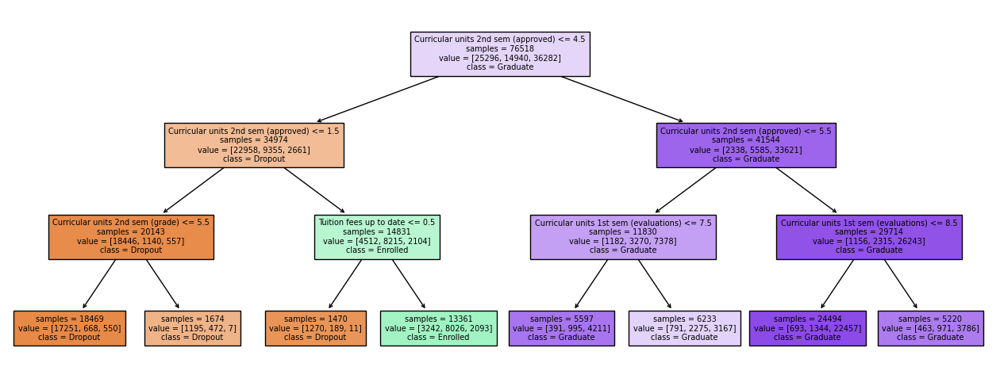

# Playground Series S4E6 - 学生辍学预测（Accuracy，多分类集成诊断）

> 主题：tabular ｜ 子类：— ｜ 领域：教育（合成数据） ｜ 类别：Playground
> 截止：2024-06-30 ｜ 队伍数：2684 ｜ 机制：标准赛 ｜ 指标：Accuracy
> 数据来源：`intel/playground-series-s4e6/`（80 条主题索引 + 6 篇 write-up 正文）

## 1. 任务与数据

- 预测目标：学生状态三分类（Dropout / Enrolled / Graduate），Accuracy。
- 结构极简：浅决策树即可看到两大主导特征——**第二学期通过课程数**（≥5 → Graduate；≤1 → Dropout）与**学费是否缴清**；其余特征边际贡献有限。

## 2. 验证方案

- 主流 5 折 StratifiedKFold；用 REFCV（带 CV 的递归特征消除）确定入集模型（6th 引用的公开 notebook 方法）。
- 6th 的观察：本场随机性大，**单模型/极小集成表现异常好**——有选手仅一次提交拿到第 2；他自己用 XGB+LGBM 小集成进前 6。

## 3. 模型家族

| 方案 | 使用者层次 | 关键点 | 出处 |
| --- | --- | --- | --- |
| 多分类集成 + 置信度诊断 | 社区分析 | 三列概率的多样性度量方法 | topic 512220 |
| XGB+LGBM + Optuna + 原数据 | 6th | 小集成、少量模型即可 | topic 515989 |
| AutoML Grand Prix 系列方案 | 社区 | 与主赛并行 | topic 509631 |

## 4. 关键技巧

- **多分类模型多样性诊断**（本场最有价值的方法帖）：三列概率无法直接用相关系数比较 → 定义**置信度标量**（0=均匀猜测 1/3，1=完全确定；OOF 错的样本取负号），把三分类预测压成单列后再做相关性/KS 检验/散点图；蓝色象限即"一个模型自信且对、另一个错"的区域——**集成收益的来源可被可视化定位**。
- 集成成员建议含"低置信上限"的模型（如 SVC：自信度峰值仅 ~0.87），其错误模式与 GBDT 不同。
- 浅决策树当 EDA：一屏看清主特征与分割点（本场两特征规则几乎复刻标签逻辑）。

## 5. 可迁移性评估

- **可直接迁移**：多分类置信度标量的构造与用法；"集成收益象限"分析；浅树做特征重要性速查；小集成优先于大集成的场景判断。
- **需要前提**：干净的 OOF 概率；准确性指标下"置信但错误"与"不置信但正确"的区分。
- **不建议照搬**：不加诊断地把几十个模型盲混（本场证明可能有害）。

## 6. 对新手的关键启示

- 分类概率不止能算准确率：给每个预测配一个"自信度"，就能像回归一样分析模型互补性。
- 数据简单时别过度工程：本场 2 个特征 + 小集成即可前列，大集成反而拖累。
- 用浅决策树先看全貌，避免一上来就堆模型。

## 7. 轻读结论（2026-10 补）

**一句话**："Accuracy + 合成数据"把榜面噪声放到最大——本场同时出现"承认公榜彩票并给它 0.86 权重"（AGP 1st）与"小集成优于大集成"（6th）两种相反证据；关键是明确自己走哪条路线。

- AGP 1st（32 票）：公开 notebook 是"彩票"（离线无法解释）→ 0.14 自研 + 0.86 彩票模型；自研用 AutoGluon 3h（log-loss 早停、accuracy 选择）；序数当数值、加原数据有益，样本权重无用。
- carl（36 票）：特征工程全徒劳、删弱特征掉分；**仅改 seed（42→24）公榜 0.83875→0.83679** → 运气成分极大。
- 6th（55 票）：5 折 + XGB/LGBM 小集成 + Optuna；"多模型集成有害"，单模/极小集成最好（有"一次提交拿第 2"的案例）。
- ravi20076（32 票）：24 小时赛分段实验 + 留底提交，融合公开 kernel 到 0.83924。

**裁决**：噪声主导的榜面上，集成会放大噪声；先做"加/不加原数据""序数 vs 类别"的单变量对照，FE 的优先级最低。

**悬案**：公开彩票 notebook 的机制未解释；3rd 单 XGB 帖（515983）与离群点检测帖（511076）未细读。

## 8. 图表证据

**图 1**（topic 509073）：深度 3 决策树——`Curricular units 2nd sem (approved)` 直接分出 graduate/dropout 两翼，中间由 `Tuition fees up to date` 区分 enrolled。

## 9. 出处

- 多分类模型的集成适配度诊断：https://www.kaggle.com/competitions/playground-series-s4e6/discussion/512220
- 6th：小集成与随机性观察：https://www.kaggle.com/competitions/playground-series-s4e6/discussion/515989
- 两个最重要的特征（浅树规则）：https://www.kaggle.com/competitions/playground-series-s4e6/discussion/509073
- AGP 1st（0.14/0.86 彩票加权）：https://www.kaggle.com/competitions/playground-series-s4e6/discussion/509631
- carl 的 Pt.2 复盘（seed 敏感）：https://www.kaggle.com/competitions/playground-series-s4e6/discussion/509642
- ravi20076 的一天四段实验：https://www.kaggle.com/competitions/playground-series-s4e6/discussion/509665
- 轻读全本：`analysis/deep/playground-series-s4e6.md`（Tier B 轻读：对照矩阵/裁决/证据分级/悬案 + 1 图证）
