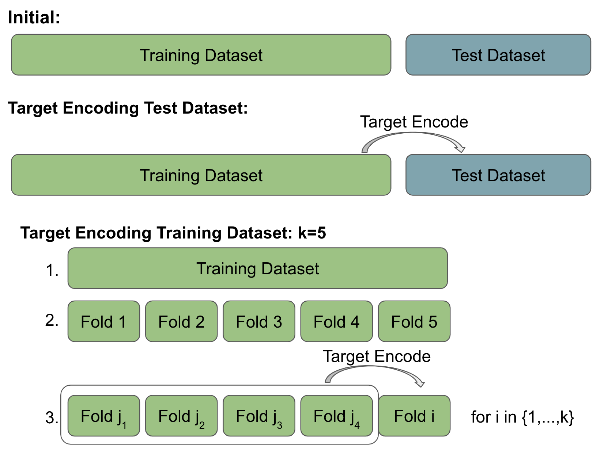
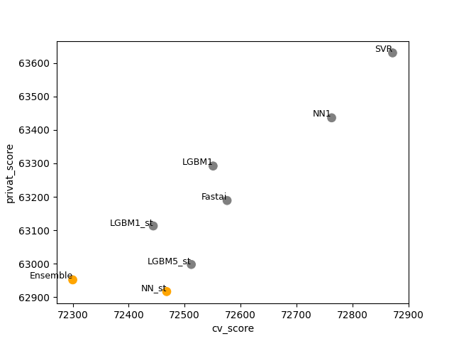

# Playground Series S4E9 - 二手车价格预测

> 主题：tabular ｜ 子类：— ｜ 领域：汽车（合成数据） ｜ 类别：Playground
> 截止：2024-09-30 ｜ 队伍数：3066 ｜ 机制：标准赛 ｜ 指标：MSE（RMSE）
> 数据来源：`intel/playground-series-s4e9/`（80 条主题索引 + 6 篇 write-up 正文）

## 1. 任务与数据

- 预测目标：二手车价格（回归 RMSE）；合成数据 + 原始数据；本场发生大洗牌。
- 指标量级特殊：RMSE 在 63000 量级（不是 0.63）——这直接引出本场最有价值的教训（见 81st 的 HC 容差）。

## 2. 验证方案

- 1st：20 折 CV；原数据入模（LGBM 甚至加两次）；所有目标编码折内重算（leak-free）；AutoGluon 的 fastai 计算用嵌套 20 折保证无泄漏。
- 81st：**HC 容差必须按指标量级设定**——他用 tol=1e-5 相当于拟合到第 10 位有效数字；赛后重跑 tol=1 显示私榜差 54/63000（0.1%），但名次从第 5 掉到第 81。**"CV 涨、公开榜只微涨"本身就是过拟合信号**。
- 4th：只用带 OOF 的公开模型做集成（"没有 OOF 就不能做正经 ensembling"）。

## 3. 模型家族

| 方案 | 使用者层次 | 关键点 | 出处 |
| --- | --- | --- | --- |
| 堆叠 NN（CatBoost 离群分类器的 OOF 当特征喂 LGBM/NN） | 1st | 分类器预测离群价 + 20 折 + 原数据 | topic 537052 |
| 110 公开 OOF + 40 自有模型 → 爬山 | 81st | "回归套分类"嵌套模型；HC 容差复盘 | topic 537202 |
| 32 模型爬山（全部自有）+ AutoGluon 缓存模型抽取 | 4th | 真正的 ensembling vs 猜权重的"blending" | topic 536973 |

## 4. 关键技巧

- **离群分类器当特征**（1st）：用 CatBoost 分类器预测"是否离群价"（IQR 法），其 OOF 概率作为特征喂给回归模型。
- **"回归套分类"**（81st）：5 折 XGB 内再嵌 5 折，训练 50 类价格分箱的分类 NN，用 50 个概率当二级 XGB 特征——嵌套保证无泄漏，且足够多样。
- **AutoGluon 模型工厂**：从 AutoGluon 目录里"捞出"单模（RF/ET/XGB/LGBM/FastAI NN）直接入池（4th）；AG 的嵌套 CV 也直接当 OOF 源。
- 4th 的哲学：**"blending works, but 'blending' doesn't"**——有 OOF 的规范集成有效；猜权重混合公开解不是。
- 原数据收益大（4th 迟到 2 天加入也涨 ~20 点）——本场属"原数据该用"的一类。

## 5. 可迁移性评估

- **可直接迁移**：HC/搜索算法的容差按指标量级设定（通用工程规范）；离群分类器特征；嵌套"回归套分类"；AutoGluon 模型抽取；只集成带 OOF 的模型。
- **需要前提**：多折与嵌套计算预算；对指标量级/有效数字的敏感度。
- **不建议照搬**：tol=1e-5 这类"拟合噪声位"的搜索参数；猜权重融合公开解。

## 6. 对新手的关键启示

- **量纲意识**：先把指标读数写到小本本——搜索容差、早停阈值、增益判据都要用它的量级换算。
- CV 与公开榜同时只微涨时，先怀疑过拟合，别庆祝。
- 集成的前提是干净的 OOF；看到"高分 blender"先查它有没有 OOF 与折证据。

## 7. 轻读结论（2026-10 补）

**一句话**：六位数 RMSE 下的元集成赛——**干净 OOF（嵌套 TE）+ 跨家族多样性 + 匹配有效数字的停止容差**是三个胜负点。

- #1（95 票）：计划中的 Ridge 集成只能第 2；最终用 NN meta（+4 个 OOF 特征）夺冠；其 notebook 私 62957.8（前三）。
- 81st：tol=1e-5 → 私 63057（81 名）vs tol=1 → 私 63003（约第 5）——CV 更"好"反而更差，"第 5 位有效数字"才是停止线。
- #4（48 票）：32 模型爬山（FM/Lasso/CatBoost/LAMA/AutoGluon 树）；原始数据 +~20 点；FE 只提 CV 不提 LB。
- TE 帖（63 票）：外层 5 折 × 内层 5 折的无泄漏 target encoding（图 1）。
- AutoML GP 3rd：公共解加权 + bagging + 预测取 5 的倍数。

**悬案**：2nd/3rd 主赛方案未收录；20 折嵌套 TE 的成本收益无消融；公私排序对容差敏感（官方名次未核）。

## 8. 图表证据

**图 1**（topic 533961）：TE 规范图——测试集用全训练集编码；训练集内部再切 5 折，Fold i 只用 Fold j1..j4 编码。

**图 2**（topic 537052）：SVR 最高 CV/最差私榜，Ensemble 较低 CV/最佳私榜。

## 9. 出处

- 1st：堆叠 NN 与离群分类器：https://www.kaggle.com/competitions/playground-series-s4e9/discussion/537052
- 81st：回归套分类 + HC 容差复盘：https://www.kaggle.com/competitions/playground-series-s4e9/discussion/537202
- 4th：blending works, but "blending" doesn't：https://www.kaggle.com/competitions/playground-series-s4e9/discussion/536973
- 轻读全本：`analysis/deep/playground-series-s4e9.md`（Tier B 轻读：对照矩阵/裁决/证据分级/悬案 + 2 图证）
