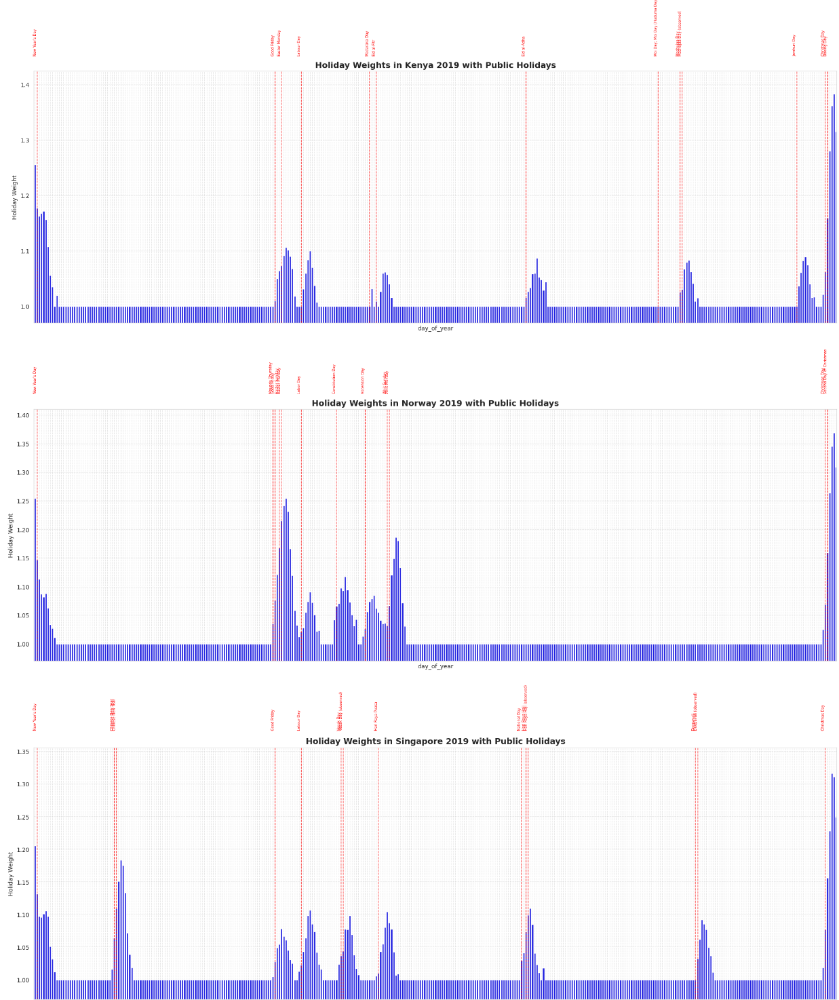

# Playground Series S5E1 - 贴纸销量预测（MAPE，预测未来乘数才是难点）

> 主题：tabular ｜ 子类：— ｜ 领域：零售（合成数据） ｜ 类别：Playground
> 截止：2025-01-31 ｜ 队伍数：2722 ｜ 机制：标准赛 ｜ 指标：MAPE
> 数据来源：`intel/playground-series-s5e1/`（80 条主题索引 + 6 篇 write-up 正文）

## 1. 任务与数据

- 预测目标：90 条时间序列（5 产品 × 6 国 × 3 店）在 2017–2019 三年的逐日销量（MAPE）。
- **预测赛的真相**（2nd 的洞察）：模型把"星期几/节假日"这类日内规律学好不难，难的是**未来年份的趋势乘数**——它由 2010–2016 训练数据外推，属猜测；不同乘数选择（1.06 / 1.00 / 带斜率）比模型精度的排名影响更大。

## 2. 验证方案

- 按时间切分（用 2015/2016 验证未来年外推能力）；乘数敏感性分析（±6% 误差带）。
- 2nd 用两份不同趋势假设的提交对冲：常数 1.06 与温和线性上行。

## 3. 模型家族

| 方案 | 使用者层次 | 关键点 | 出处 |
| --- | --- | --- | --- |
| 线性回归（周期特征+GDP/店铺/产品/国家/星期/年日+节假日）+ 乘数 | 2nd | 纯 LR 方案私榜第 6 | topic 560549 |
| Transformer（无 FE、自回归、两轮伪标签、5 种子中位数） | 社区教程 | 公榜 0.04867 | topic 559314 |
| 1st：基于公开 starter + 节假日处理 | 1st | 细节未完全展开 | topic 560629 |

## 4. 关键技巧

- **"乘数才是答案"的诚实认知**：1st/2nd 都承认未来趋势接近猜测；正确做法是**把不确定性显式建模为提交对冲**，而不是假装模型能预测趋势。
- **时间序列 DL 的三类块**（RNN/CNN/Transformer）：把 `(batch, seq, 1)` 编码为 `(batch, seq, K)` 的"自动特征"，再接全局池化+回归头；相比手工周期特征，Transformer 无 FE 也能到 0.05 级。
- **自回归 + 两轮伪标签**：35 步外推；用第 1/2 轮预测的 2017/2018 当伪标签再训——显著改善远年（2019）预测。
- 节假日布尔特征（30 个）对 LR 与 DL 都有增益；GDP 等外生变量用于跨年水平校正。

## 5. 可迁移性评估

- **可直接迁移**：外推赛的"乘数假设 + 对冲提交"策略；自回归 + 伪标签多轮；序列块式 DL 的自动特征视角；节假日/日历特征清单。
- **需要前提**：时间切分验证；对趋势外推不确定性的诚实态度。
- **不建议照搬**：用随机 CV 验证时间外推；把全部预算花在日内规律上而忽略趋势乘数。

## 6. 对新手的关键启示

- 遇到"预测未来几年"的题，**第一件事是问"未来水平（趋势）怎么定"**，第二件才是模型选择。
- 预测赛的最终分数常由 1–2 个外生假设决定——学会用"双提交对冲"表达不确定性。
- Transformer 在时序上可以免手工特征，但自回归+伪标签这些训练技巧仍是必需品。

## 7. 轻读结论（2026-10 补）

**一句话**：多年度销售预测里，**未来年份的整体倍率（trend）才是名次决定项**（2nd：误差倍率 ±6%，只能"猜"；3rd：**恒定轨迹（沿用 2016）胜过大举延续上升趋势**，这也是本场洗牌主因）；其次是假日效应处理。

- 1st（560629）：基于 kdmitrie 起步模型 + 往届假日方案（细节在 notebook）。
- 2nd（560549）：两条独立路线——**Transformer-only**（全商品联合 + 30 假日布尔 + **两轮伪标签** + 5 seed 中位数 + 不用倍率）→ 公 0.04867/私 0.04967（59 名）；**Linear Regression-only + 假日** → 公 0.04733/私 0.04650（**私榜第 6**，简单线性反超 Transformer）；最终提交 = 恒定 1.06 与温和线性上升两版对冲。
- 3rd（560554）：分解（day-of-week/国家 GDP/门店/商品/day-of-year）→ 残差曲线预测；**恒定 vs 上升的两版对照中恒定大胜**；假日 = 上一年归一化假日值的中位数 + 处理滞后与浮动日期（图 1：Kenya/Norway/Singapore 权重差异巨大）。
- 社区：Transformer 无 FE 0.052（80 票）、显然的分解（72 票）、holidays 新列（52 票）、四舍五入（30 票）、WaveNet starter（27 票）。

**裁决**：趋势假设做成一等变量并用两份提交对冲；假日按国家/年份标定并处理漂移；当主信号是结构+假日+趋势时，线性模型性价比高于大网络。

**悬案**：4th/6th–11th 方案缺失；1st 实现细节在 notebook；"正确的未来倍率"无客观依据。

## 8. 图表证据

**图 1**（topic 560554）：Kenya/Norway/Singapore 2019 的假日权重与 day_of_year（红虚线为公共假日）——假日幅度/持续/滞后在国家间差异巨大。

## 9. 出处

- 1st：基于公开 starter 的改进：https://www.kaggle.com/competitions/playground-series-s5e1/discussion/560629
- 2nd：Transformer 与 LR 的堆叠 + 乘数分析：https://www.kaggle.com/competitions/playground-series-s5e1/discussion/560549
  - Transformer 无特征工程教程：https://www.kaggle.com/competitions/playground-series-s5e1/discussion/559314
  - 3rd（31 票）：https://www.kaggle.com/competitions/playground-series-s5e1/discussion/560554
  - 显然的分解（72 票）：https://www.kaggle.com/competitions/playground-series-s5e1/discussion/554349
  - 四舍五入（30 票）：https://www.kaggle.com/competitions/playground-series-s5e1/discussion/555149
- 轻读全本：`analysis/deep/playground-series-s5e1.md`（Tier B 轻读：对照矩阵/裁决/证据分级/悬案 + 1 图证）
