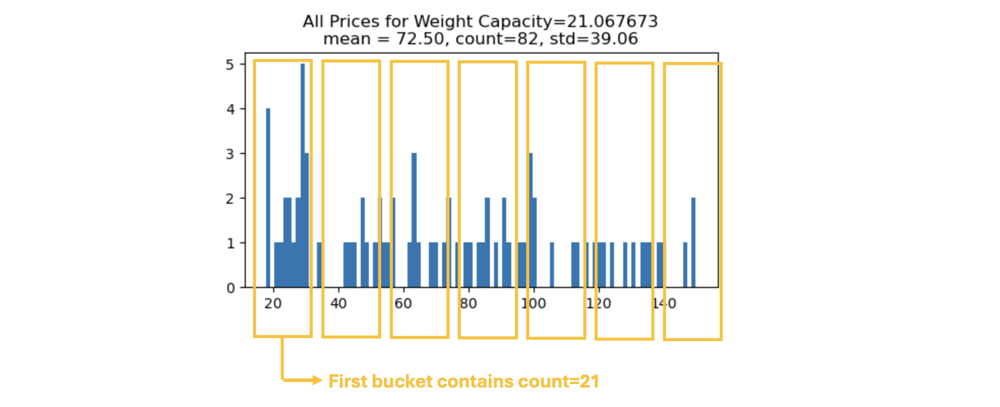

# Playground Series S5E2 - 背包价格预测（合成痕迹挖掘名局）

> 主题：tabular ｜ 子类：— ｜ 领域：零售（合成数据） ｜ 类别：Playground
> 截止：2025-02-28 ｜ 队伍数：3393 ｜ 机制：标准赛 ｜ 指标：MSE（RMSE）
> 数据来源：`intel/playground-series-s5e2/`（80 条主题索引 + 6 篇 write-up 正文）

## 1. 任务与数据

- 预测目标：背包价格（回归 RMSE）；约 400 万行合成数据。
- "怪数据"背景：原始数据的目标是**随机分配的**（数据作者确认），但合成扩增过程本身留下了可预测结构——信号不在"背包语义"里，在**生成机制**里。
- 信号的两层来源（社区经典分析）：原数据 10% 的行有重复 → k=1 KNN 可直接找回同款价格；合成过程把 5 万行扩成 400 万行 ≈ 每行 80 个"孪生副本" → **KNN 与 groupby 聚合本质上是在找孪生行**。

## 2. 验证方案

- 海量实验流（1st）：1 个月训练 300+ XGB、试过上千个特征想法；用 RAPIDS cuDF-Pandas 把实验速度拉满——"本场的胜负手是实验吞吐"。
- 5th 的 CV–LB 差分析：多数方案 CV–LB 差约 0.2，他的 AutoGluon 集成差 0.26 → 疑过拟合，改选"差 ~0.2 且 LB 最好"的 Ridge 集成。

## 3. 模型家族

| 方案 | 使用者层次 | 关键点 | 出处 |
| --- | --- | --- | --- |
| 单模型 500 特征（或 138 特征 T4 版） | 1st | 特征工程取胜，无需集成 | topic 565539 |
| 25 模型集成 + 公开笔记本混入 | 5th | CV–LB 差筛选；混入公开解冲私榜 | topic 565583 |
| 先解释"信号是什么"再建模 | 社区 | KNN/groupby 抓孪生行 | topic 564056 |

## 4. 关键技巧（1st 的特征工程清单，本场精华）

- **groupby(COL1)[COL2].agg(STAT)** 全家桶：mean/std/count/min/max/nunique/skew……目标列参与时用嵌套折防泄漏。
- **groupby(COL1)['Price'].agg(直方图分桶)**：对每组价格做等宽分桶计数，把桶计数返还给行——作者自称未见他人用过，桶数为超参。
- **groupby 分位数**：QUANTILES=[5,10,40,45,55,60,90,95] → 8 个新列。
- **所有 NAN 合成一个二进制列**（再参与 groupby/组合）。
- 数值分箱 + **float32 小数位提取**（像从产品 ID 提取品牌/颜色信息）。
- 8 个类别列的两两组合（28 个新类别列）。
- **原数据当 MSRP 锚**：合成行 = 门店价，原数据 = 厂商建议零售价，给每行注入"参考价"。

## 5. 可迁移性评估

- **可直接迁移**：groupby 聚合与直方图分桶特征；NAN 合成单一列；小数位特征；类别组合；"锚数据"用法（原数据/参照表）；实验吞吐工程（cuDF）。
- **需要前提**：大规模分组计算资源；合成数据 + 原数据可得的场景。
- **不建议照搬**：把"孪生行挖掘"当真实业务技能（本场特有）；忽视 CV–LB 差（5th 的 0.26 vs 0.2 差点选错）。

## 6. 对新手的关键启示

- "数据没有信号"通常是错的：先问**数据是怎么生成的**，信号常藏在复制/扩增/去重的痕迹里。
- 本场证明特征工程的极致可以免去集成（单模型夺冠）——先榨干特征，再谈 ensemble。
- 对怪异数据，去读社区的"信号解释帖"，比盲目调参快得多（本场解释帖直接给出 KNN/groupby 的理论依据）。

## 8. 轻读结论（2026-10 补）

**一句话**："目标几乎随机"的背包价格赛，信号藏在**孪生行/复制结构**（原数据 10% 重复、合成每行约 80 份副本）——1st 用**单模型 XGBoost + 500 个手工特征**（groupby 全组合 + 自创直方图分桶聚合）夺冠，138 特征的 T4 版同样第一；3rd 用距离/COMBO/外部统计 + 自编码器潜变量 + BayesianRidge 栈；5th 用 CV–LB gap 选提交并与公开 notebook 混合。

- 1st（565539）：300+ XGB、上千 FE 想法/月；直方图分桶、分位数、全 NaN 二进制列、Weight Capacity 分箱/小数位、28 个类别组合、原数据当 MSRP、除法特征。
- 信号解释（564056，76 票）：原数据 10% 行有重复；合成 ~80 副本/行；groupby/KNN 都是找同源行。
- 3rd（565653）：距离特征、COMBO=类别×100+WeightCapacity、外部价格统计、cuML TE、AE 潜变量、4 树+BayesianRidge、10 折。
- 5th（565583）：CV–LB gap 0.2 vs 0.26 的选择；与公开 notebook 混合后私榜 38.63455（第 5）。
- 赛制：中途追加 `training_extra.csv`（12 倍数据）；"目标是否噪声"讨论。

**裁决**：先逆向生成过程找复制结构；信号集中时把 FE 做透（单模可夺冠）；CV–LB gap 可作为选择标准；合成技巧与通用技巧分开归档。

**悬案**：2nd/4th/6th–10th 未收录；分桶数最优值未知。

## 9. 图表证据

**图 1**（topic 565539）：Weight Capacity=21.067673 组的 7 桶直方图计数特征。

## 10. 出处

- 1st：单模型 + 特征工程（含直方图分桶等）：https://www.kaggle.com/competitions/playground-series-s5e2/discussion/565539
- 5th：噪声堆里找信号针（CV–LB 差分析）：https://www.kaggle.com/competitions/playground-series-s5e2/discussion/565583
- 背包数据信号解释（孪生行）：https://www.kaggle.com/competitions/playground-series-s5e2/discussion/564056
- 3rd：完整管线：https://www.kaggle.com/competitions/playground-series-s5e2/discussion/565653
- RAPIDS starter（70 票）：https://www.kaggle.com/competitions/playground-series-s5e2/discussion/563743
- 追加训练数据（37 票）：https://www.kaggle.com/competitions/playground-series-s5e2/discussion/561008
