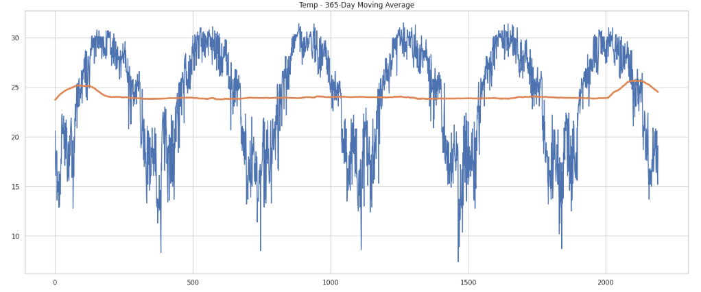
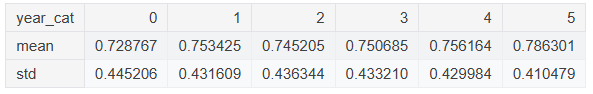
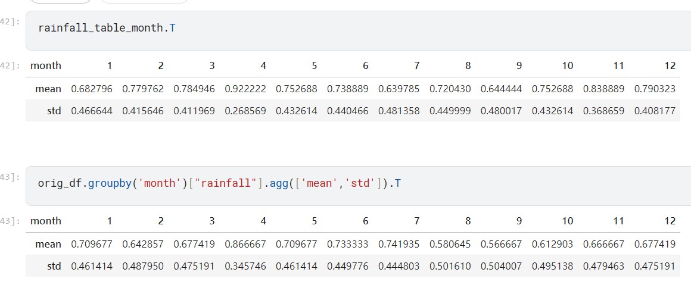

# Playground Series S5E3 - 降雨预测

> 主题：tabular ｜ 子类：— ｜ 领域：气象（合成数据） ｜ 类别：Playground
> 截止：2025-03-31 ｜ 队伍数：4381 ｜ 机制：标准赛 ｜ 指标：ROC AUC
> 数据来源：`intel/playground-series-s5e3/`（80 条主题索引 + 6 篇 write-up 正文）

## 1. 任务与数据

- 预测目标：基于气象特征预测是否会降雨（二分类 AUC）。
- 数据规模小：train 约 6 年 2190 行；原数据 1 年 366 行（合成数据的来源）。
- 关键结构：测试集是"两个新年份" → 按年份分组验证成为共识；本场是著名的**大洗牌**场次，公开榜与私榜排名剧烈变动。

## 2. 验证方案

- 主流：GroupKFold by year（6 折，每年一折），2nd 与 54th 均如此；54th 还以嵌套方式（外层按年）做特征工程与调参。
- 原数据混入的漂移检验：54th 用对抗验证发现"加入原数据 + 时间特征"会让 train 与 test 可区分 → 弃用时间特征；置换重要性印证。
- 提交选择策略（18th）：选"CV 高 − 公开榜低"的两份提交——公开榜不可信时的防御姿态。

## 3. 模型家族

| 方案 | 使用者层次 | 关键点 | 出处 |
| --- | --- | --- | --- |
| XGB（原数据拼行）+ TabPFN + RAPIDS SVC（原数据拼列）等权集成 | 2nd（实际登顶/亚军） | 三个弱模型等权混出 1st/2nd | topic 571176 |
| TabPFN 单模 + 基础 FE | 37th | 小数据下 TabPFN 开箱即强，弃原数据与重 FE | topic 571139 |
| 单 XGBoost + 自定义 AUC 损失 | 18th | XGB 自定义损失的实用性（vs LGBM/NN） | topic 571021 |
| 多模型 + 年度相对温度/比率特征 | 54th | 按年嵌套 CV；换模型换特征集 | topic 571133 |
| Linear SVC + 受控非线性项 | 社区 | 小数据优先线性模型 + 前向选择 | topic 568268 |

## 4. 关键技巧

- **原数据的两种接法**（2nd 的胜负手）：拼行（concat，作为第 7 组训练）vs **拼列（merge，按特征列对齐）**——拼列 + SVC 单模即达 0.90610（亚军级），三模型等权集成 0.90728（冠军级）。
- 小数据（数千行）不做过重特征工程；等权平均以防集成过拟合；模型多样性靠"用原数据的姿势不同"制造。
- 定制约：AUC 自定义损失在 XGBoost 中比 LGBM/NN 更可控；base_score 差异需要注意（18th）。
- 特征：比率特征、年度相对值（当年温度均值差值）稳定有效；时间特征与外部数据混用时先做对抗验证。
- 大洗牌防御：不追公开榜，等权/秩平均，提交选择参考 CV−LB 差值。

## 5. 可迁移性评估

- **可直接迁移**：按时间分组 CV；原数据"拼行 vs 拼列"的对照实验；小数据偏好线性/简单模型与等权集成；对抗验证决定外部数据用法。
- **需要前提**：存在可获取的原数据（合成赛特有）；TabPFN 类先验模型适合小数据。
- **不建议照搬**：盲信公开榜（本场洗牌剧烈）；在小数据上堆复杂 FE；把自定义损失当银弹（比分接近 5 位小数时收益有限）。

## 6. 对新手的关键启示

- 数据小 → 先问"最简模型能到哪"，再决定投入；TabPFN/SVC 这类"低调强模型"值得进工具箱。
- **同一份外部数据的接入方式（行/列）可能比模型选择更重要**——做对照实验而不是默认拼行。
- 洗牌场合的定稿原则：稳健（等权/秩平均）+ 不看公开榜 + 参考 CV−LB 背离度。

## 8. 轻读结论（2026-10 补）

**一句话**：146 行的公榜把本场变成"探榜 + 洗牌"的极端案例（公开分 0.961、10 份 AUC=1.0），真正的胜负手是**原始数据的接法**：2nd 用同一份香港数据，拼成新行（XGB 私 0.90317）与 merge 成新列（RAPIDS SVC 单模私 0.90610 → 第 2），其未提交的三模型等权融合私榜 0.90728 本可第 1。

- 2nd（571176）：零 FE + 6 折按年 GroupKFold + 等权平均；原数据两接法都试；最终六模型等权私 0.90604/0.90599。
- 54th（571133）：留一年嵌套 CV；对抗验证后弃时间特征；比值 + 年度相对温度；XGB+LGBM 秩平均私 0.90669（未提交）。
- 18th（571021）：单 XGB + 自定义 AUC 损失；前向特征选择；模拟显示加原数据只有 50% 改善 → 不用；提交按 "CV−公榜" 选。
- 37th（571139）：TabPFN + 基础 FE + 纯合成数据取胜。
- 社区：公榜 146 行、探榜指南、标签错误、"Trust Your CV"。

**裁决**：小公榜赛以按年分组 CV 为准；外部数据要按"接法×模型"做对抗验证；小数据用简单模型 + 等权平均；提交选择是独立技能。

**悬案**：真实 1st 方案未收录；标签错误成因未明；归档帖 571015 未细读。

## 9. 图表证据

**图 1**（topic 571133）：6 年温度周期平稳（365 日均线）。

**图 2**（topic 571133）：各年降雨率接近，支持按年 CV。

**图 3**（topic 571133）：赛方 vs 原始数据的月度降雨分布差异。

## 10. 出处

- 2nd Place：GBDT + NN + SVR + 原数据两接法：https://www.kaggle.com/competitions/playground-series-s5e3/discussion/571176
- 54th：特征工程、年度嵌套 CV、对抗验证：https://www.kaggle.com/competitions/playground-series-s5e3/discussion/571133
- 18th：单 XGBoost + 自定义 AUC 损失：https://www.kaggle.com/competitions/playground-series-s5e3/discussion/571021
- 37th：TabPFN 小数据打法：https://www.kaggle.com/competitions/playground-series-s5e3/discussion/571139
- Linear SVC + 受控非线性：https://www.kaggle.com/competitions/playground-series-s5e3/discussion/568268
- 全方案归档帖（社区大合集）：https://www.kaggle.com/competitions/playground-series-s5e3/discussion/571015
- 公榜 146 行（41 票）：https://www.kaggle.com/competitions/playground-series-s5e3/discussion/568465
- 探榜指南（30 票）：https://www.kaggle.com/competitions/playground-series-s5e3/discussion/568865
