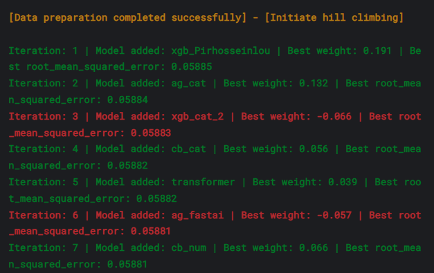

# Playground Series S5E5 - 卡路里消耗预测

> 主题：tabular ｜ 子类：— ｜ 领域：健康（合成数据） ｜ 类别：Playground
> 截止：2025-05-31 ｜ 队伍数：4316 ｜ 机制：标准赛 ｜ 指标：MSLE（RMSLE）
> 数据来源：`intel/playground-series-s5e5/`（80 条主题索引 + 6 篇 write-up 正文）

## 1. 任务与数据

- 预测目标：根据运动与生理特征预测卡路里消耗（回归，RMSLE）。
- 数据特性：全数值特征、无缺失；数据量大；本场发生**大洗牌**（公开榜与私榜大幅错位）。
- 原数据作用有限（7th 验证：加入后提升甚微）——本届主要收益来自多样性与集成，而不是外部数据。

## 2. 验证方案

- 标准 5 折 OOF（多数方案）；1st 在 5 折 OOF 上做爬山定权重，再**全量重训**：迭代数=1.25×5 折最优迭代均值、多种子平均——作者称"每个比赛都能拿到稳定增益"。
- 7th 明确站队：**Trust CV，拒绝无脑 blender**（公开 notebook 手工调权重过拟合 LB 已成为 Playground 公害）。
- 2nd：提交两类互补方案对冲（74 模型 Ridge vs 11 模型 HC）。

## 3. 模型家族

| 方案 | 使用者层次 | 关键点 | 出处 |
| --- | --- | --- | --- |
| GPU 爬山（数百模型 → 精选 7 个） | 1st | cuML 加速；低 CV 模型贡献 25% 权重 | topic 582611 |
| Ridge 集成（30 模型） | 6th | Ridge 略胜 HC；两方案私榜差距极小 | topic 582518 |
| CatBoost 为主 + 多集成器对照 | 7th | 无 FE；HC CV 最好但 Ridge 私榜夺冠 | topic 582591 |
| 74 OOF Ridge + 11 模型 HC | 2nd | 最高私榜来自小而准的 HC 组合 | topic 582700 |
| log1p 空间集成规范 | 社区教程 | RMSLE 的正确平均姿势 | topic 576111 |

## 4. 关键技巧

- **RMSLE 集成规范**（高频考点）：先在 `log1p` 空间做加权平均/爬坡/Ridge（用 RMSE 目标），最后 `expm1` 还原——直接在原空间平均会被大值带偏。
- **残差栈**：NN 学线性回归残差（CV 0.0608→0.0599）；XGB 再学 NN 残差——单个不一定涨分，但制造**互补误差**供集成挑选（1st）。
- **特征构造**（1st）：全对特征的 log1p 乘积/商/和/差；把数值分 9 箱当类别 + 两两组合（81 类）喂 CatBoost；1–3 个分组列的 z-score（26 个）。
- **多样性优先于单模 CV**：cuML TargetEncoder 的 XGB 单模 CV 差，但爬山给它 25% 权重并改善总 CV/私榜。
- **全量重训技巧**：固定迭代放大 1.25× + 多种子平均（1st 的通用收尾）。

## 5. 可迁移性评估

- **可直接迁移**：RMSLE→log 空间集成；残差栈制造多样性；爬山/Ridge 双集成器对照；全量重训+种子平均；分组 z-score 特征。
- **需要前提**：GPU 与 cuML 加速（数百模型的搜索量）；大量 OOF 存档。
- **不建议照搬**：无 CV 依据的 blender 式手工权重（本场社区明确批评）；期望原数据必然带来提升。

## 6. 对新手的关键启示

- 指标会改变集成数学：RMSLE 用 log 空间、MAE 用中位数、RMSE 用均值——先想清楚再写 blend 代码。
- 爬山选出的模型可能"单看都一般"——**集成贡献 ≠ 单模分数**。
- 大洗牌场合：少交多验、私榜直觉来自 CV 与多样性，而不是公开榜名次。

## 7. 轻读结论（2026-10 补）

**一句话**：RMSLE 的正确打开方式 = **在 `log1p` 空间做一切**（平均/加权/Ridge/HC），再 `expm1` 还原；集成胜负则取决于"多样性 vs 过度拟合 OOF"——本场 HC 的 CV 最好却常输给 Ridge。

- RMSLE 教程（140 票）：MSE→算术平均、MAE→中位数、**RMSLE→log 空间加权平均**。
- 1st（GPU HC）：数百候选 → 7 模型；**弱模型（cuML-TE XGB，单模 0.06XX）占 25% 权重**；残差堆叠（NN-over-LR 0.0608→0.0599）；"100% 重训 + 迭代×1.25 + 多种子"；priv 0.05841。
- 2nd："Trust CV and diversity"；最佳私榜是 11 模型 HC（仅正权重），含 LR/ResMLP/LNN 等异质成员 + 分类概率残差二次 CatBoost。
- 6th：Ridge（priv 0.05846）击败 HC（0.05848），HC 日志里出现负权重（-0.066/-0.057）。
- 7th：只把 Sex 转整数、几乎无预处理；AutoGluon 本场不具竞争力；明确反对盲混。

**裁决**：指标决定集成空间；成员选择看错误结构而非单模分数；噪声赛里 Ridge/非负 HC 比自由 HC 稳；折内模型推理时按 1/(K−1) 放大迭代数。

**悬案**：3rd–5th 方案缺失；洗牌原因未量化；1st 的候选模型清单未列全。

## 8. 图表证据

**图 1**（topic 582518）：HC 逐轮加模型，第 3/6 轮出现负权重（-0.066、-0.057）——HC 过拟合 OOF 的直观证据。

## 9. 出处

- 1st：GPU 爬山与七模型组合：https://www.kaggle.com/competitions/playground-series-s5e5/discussion/582611
- 2nd：Trust CV and diversity：https://www.kaggle.com/competitions/playground-series-s5e5/discussion/582700
- 6th：30 模型 Ridge 集成：https://www.kaggle.com/competitions/playground-series-s5e5/discussion/582518
- 7th：拒绝 blender、Ridge vs HC：https://www.kaggle.com/competitions/playground-series-s5e5/discussion/582591
- RMSLE 集成教程：https://www.kaggle.com/competitions/playground-series-s5e5/discussion/576111
- 往届方案洞察（49 票）：https://www.kaggle.com/competitions/playground-series-s5e5/discussion/576731
- 轻读全本：`analysis/deep/playground-series-s5e5.md`（Tier B 轻读：对照矩阵/裁决/证据分级/悬案 + 1 图证）
