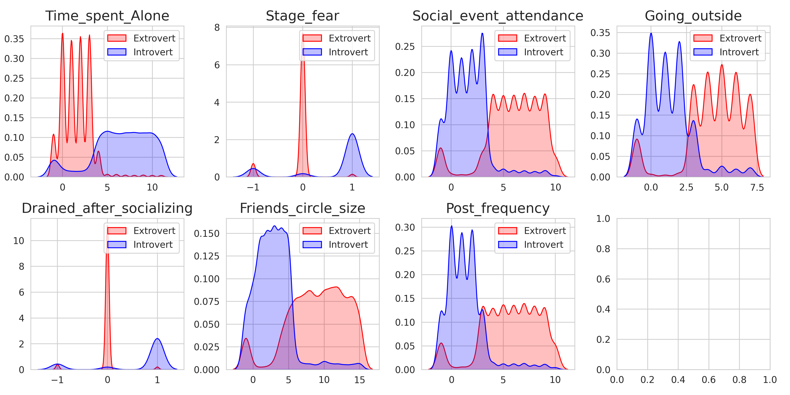
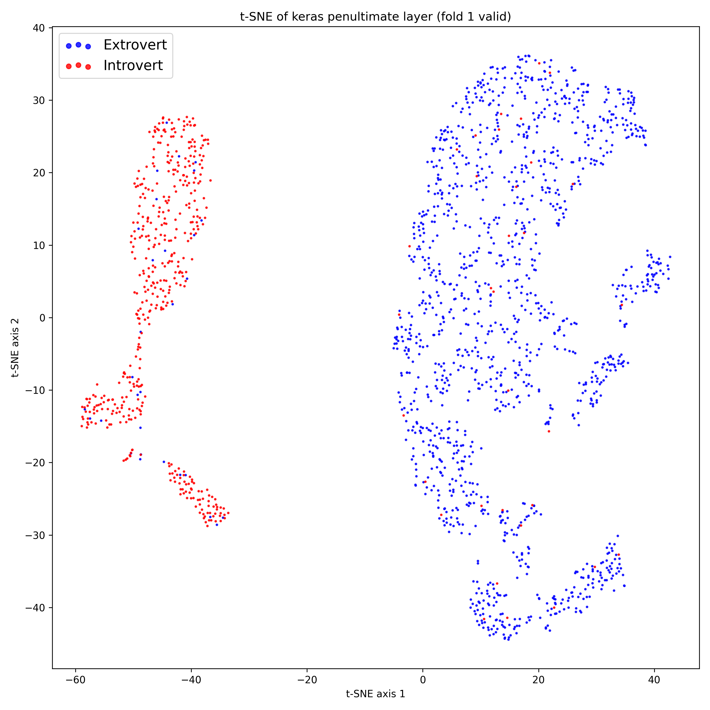

# Playground Series S5E7 - 内向/外向预测（精简）

> 主题：tabular ｜ 子类：— ｜ 领域：人格（合成数据） ｜ 类别：Playground
> 截止：2025-07-31 ｜ 队伍数：4329 ｜ 机制：标准赛 ｜ 指标：Accuracy
> 数据来源：`intel/playground-series-s5e7/`（80 条主题索引 + 6 篇 write-up 正文）

## 任务

根据行为特征（独处时间、社交活动、朋友数量等）二分类"内向/外向"。指标为 **Accuracy** 且数据含大量互相矛盾的合成样本——是"数据集简单、比赛却像抽奖"的典型场次（私榜大洗牌）。

## 关键要点

- **噪声上限被社区量化**：约 500 个样本看起来与对方类完全一致（"没有模型能预测对"），提前说明少部分准确率损失是数据本身决定的。
- **特征选择哲学之争**（本场最佳方法论帖）：在 RF 上系统对照特征集——Raw 7 列（CV logloss 0.13056）、+EDA 阈值旗标 17 列（0.13008）、+bigram 交互 38 列（0.13060）、+trigram 73 列（0.13127）、bigram 取 top30（0.13063）。结论：**直觉型特征 > 交互空间地毯式轰炸**；众数/PCA 反而变差；最终 4 个最优模型按逆 logloss 加权（权重≈0.25 均等）最稳。
- EDA 单项信号极强：独处时间 > μ+2σ 时约 94% 是内向；两个布尔旗标各自 >90% 指向内向。
- Top-3 提交：50% 树 + 45% MLP + 5% LR，用 0.40 阈值标注——"简单混合 + 阈值"即可登顶，侧面印证比赛噪声大。
- 大洗牌与奖牌系统更新（bronze 事件）引发讨论：Accuracy + 噪声标签决定了很多名次由运气主导。

## 可迁移要点

- 分类指标（Accuracy）在噪声数据上名次方差极大 → 用稳健混合与阈值校准，不做公开榜冲刺。
- 先做"人类可解释的阈值特征"，再做交互特征；加大量稀有类别组合会稀释树模型信号。
- 用小规模对照表（特征集编号 × CV）替代直觉争论——该帖的表格可直接当模板。

## 轻读结论（2026-10 补）

**一句话**："数据集简单、比赛像抽奖"：公榜只有 940 个外向样本、约 10 个点决定名次，合成数据里约 500 个"特征与标签矛盾"的样本构成精度上限；最佳方法论帖证明**直觉阈值特征 > 交互爆炸**（B 组 17 列 0.13008 vs D 组 73 列 0.13127），Top-3 只是"50% 树 + 45% MLP + 5% LR + 0.40 阈值"。

- 特征集对照（588419）：A 7 列 0.13056 / B 17 列 0.13008 / C 38 列 0.13060 / D 73 列 0.13127；四模型逆 logloss 等权融合最稳。
- EDA：独处 >μ+2σ → 94% 内向；两个布尔旗标 >90%；缺失去向有信号；无 train/test 漂移。
- 难样本（587827，80 票 / 76 评论）：约 500 条矛盾样本，"没有模型能预测对"。
- Top-3（594049）：几小时 + 4 次提交；0.40 阈值。
- 社区：公榜 940 外向（32 票）、约 10 点决定比赛（29 票）、怪异结局（25 票）、概率校准（31 票）。

**裁决**：赌博型赛事固定稳健融合与阈值；登记不可预测样本；先做阈值/比例特征；Accuracy 赛把校准与阈值当独立模块。

**悬案**：1st/2nd/4th–10th 未收录；矛盾样本成因未定论。

## 图表证据

**图 1**（topic 587827）：特征的两类密度分布与重叠区。

**图 2**（topic 587445）：双簇结构 + 混叠点。

## 出处

- 特征爆发 vs 智能选择（含对照表）：https://www.kaggle.com/competitions/playground-series-s5e7/discussion/588419
- 难样本分析："我们注定失败"：https://www.kaggle.com/competitions/playground-series-s5e7/discussion/587827
- Top-3 方案（含阈值）：https://www.kaggle.com/competitions/playground-series-s5e7/discussion/594049
- 关于内向/外向的心理测量学背景：https://www.kaggle.com/competitions/playground-series-s5e7/discussion/587413
- "数据集简单，比赛不会简单"：https://www.kaggle.com/competitions/playground-series-s5e7/discussion/587445
