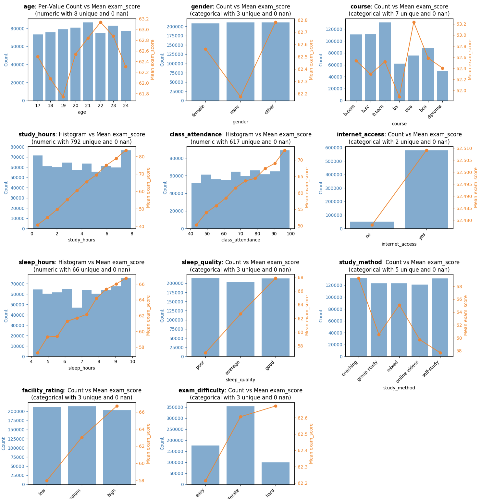

# Playground Series S6E1 - 考试成绩预测

> 主题：tabular ｜ 子类：— ｜ 领域：教育（合成数据） ｜ 类别：Playground
> 截止：2026-01-31 ｜ 队伍数：4317 ｜ 机制：标准赛 ｜ 指标：RMSE
> 数据来源：`intel/playground-series-s6e1/`（80 条主题索引 + 6 篇 write-up 正文）

## 1. 任务与数据

- 预测目标：基于学习行为特征（学习时长、出勤、睡眠、设施评分等）预测考试成绩（回归，RMSE）。
- 数据特性（EDA 帖结论）：多特征与目标近似**线性**关系；类别特征多带序数含义；目标存在边界（19.599 与 100 的截断/堆积）；低分与高分区间误差方向相反（低分被高估、高分被低估）。
- 信号启示：强线性关系 → **在线性模型残差上再建非线性模型**成为本场主流打法。

## 2. 验证方案

- 5/7/10 折 KFold 固定 seed，全流程保存 OOF（6th：这是 231 个模型还能事后集成的关键）。
- CV–LB 相关性本场很好（1st 明确优于 S5E8/S5E11），可信 CV 决策。
- 伪标签的防泄漏论证（社区教程）：折内训练两次，模型二只用训练折目标，validation 目标从不参与 → 无泄漏。
- 嵌套 CV 警告：6th 的双层线性回归堆叠自认 CV 会偏乐观，且对复杂模型有泄漏风险，仅作小幅提升手段。

## 3. 模型家族

| 方案 | 使用者层次 | 关键点 | 出处 |
| --- | --- | --- | --- |
| 190 模型 Ridge 集成 + 等距回归后处理 | 1st | 两套特征集（NN 版/GBDT 版）；RealMLP 单模全场第 7 | topic 671371 |
| 75 模型集成（60+ TabM） | 2nd | TabM 显著优于 GBM；GP 公式特征 + 残差预测 | topic 671261 |
| 231 模型 + gating 后处理 + 线性回归当特征 | 6th | 三层嵌套 CV 的线性特征；区间门控 | topic 671328 |
| 非对称加权损失 + 分歧度选择 + 离群分类器 | 13th | 按误差方向加权；用"最不一致"挑集成成员 | topic 671285 |
| 伪标签/知识蒸馏 | 社区教程 | 同一折内二次训练；换模型即蒸馏 | topic 666888 |

## 4. 关键技巧

- **线性骨架**：线性回归预测作为特征喂给树/NN（6th 的三层嵌套 CV 实现）；"非线性模型学线性残差"（EDA 帖与 2nd 共同结论）。
- **边界处理**：目标上下限处（19.599/100）用分类器门控与后处理（6th 的 gating、13th 的区间加权损失）。
- **多样性制造**：不同损失（Huber/分位数/非对称 MSE）、不同特征集、GP 公式特征（2nd 用遗传编程逆向了原数据生成公式，RMSE 8.97）。
- **集成**：Ridge 元模型 > 其他拼接器（1st 对比 HC/AutoGluon/CatBoost）；伪标签折内二次训练；"分歧度最大的模型"可能比高 CV 模型更值得选（13th）。
- **模型选择反直觉**：1st 只做少量强模型（190 个里以强模型为主），2nd/6th 做海量多样性模型——两条路都登顶，但都强调 OOF 存档与固定折。

## 5. 可迁移性评估

- **可直接迁移**：固定折+全量 OOF 存档；伪标签防泄漏写法；线性残差建模范式；Ridge 集成与等距回归后处理；分歧度选模；边界/截断目标的门控处理。
- **需要前提**：多模型算力；合成数据场景（GP 逆向公式、原数据对齐在真实数据上未必可用）。
- **不建议照搬**：无存档的海量模型（无法事后集成）；对不同折的 OOF 做双层线性堆叠（CV 会偏乐观→对复杂模型有真实泄漏风险）。

## 6. 对新手的关键启示

- 先画"特征–目标"关系：如果像本场一样大量线性，尽早引入线性模型（既是特征也是集成成员）。
- 每个实验都保存 OOF 并用同一折划分——这是决胜期一切操作的前提。
- 模型多样性不仅是"换算法"：换损失函数、换特征集、换权重方案都在制造可集成的多样性。
- 伪标签的价值原理是"更多真实特征进入训练"，不是"假标签"本身——这能帮你在新比赛里正确判断它是否适用。

## 7. 轻读结论（2026-10 补）

**一句话**：数据几乎由线性公式生成（EDA 78 票帖）——**先恢复生成式（GP/线性回归，单独 RMSE≈8.97），再做大规模 Ridge 集成**；本场 NN（RealMLP/TabM）系统性不弱于 GBDT。

- 1st（671371）：两套特征集（NN 友好 / GBDT 友好）；**专注做强单模**（最佳单模可排第 7；RealMLP CV 8.58742 最好）；**190 模型 Ridge 集成**（HC/AG/CatBoost 集成器更差）→ CV 8.56634 / LB 8.53096 / PB 8.57273。
- 2nd（671261）：TabM 单模"远远最好"；75 模型里 68 个是 NN（60 个 TabM）；170–700 特征 × 6 超参组合 + **GP 公式残差建模**（两条公式 RMSE 8.9703/8.9741）。
- 6th（671328）：单模 FE 失败但**为集成有效**（200+ XGB + 公开 notebook）；核心纪律=**保存 OOF + 统一 KFold/seed + 三层嵌套 CV**；把 Linear Regression 当最强特征（树只看序、线性模型吃单调变换）。
- 13th（671285）：173 模型 + HC + Ridge；**分数范围偏差**（低分高估/高分低估）→ target 相关加权 MSE（长尾端 4×/2×/1.5×/3×）。

**裁决**：合成回归先恢复生成式；NN 与 GBDT 平权投入；FE 的价值在"多样性"；OOF/KFold 纪律是事后集成的前提；注意标签截尾与分数范围偏差。

**悬案**：3rd–5th/7th–12th 方案缺失；1st 引用的"公式"未展开；2nd 的 75 模型清单未列。

## 8. 图表证据

**图 1**（topic 665965）：11 个特征的分布与均值曲线——study_hours/class_attendance/sleep_hours/facility_rating 等近乎单调线性，解释本场"恢复公式 + 线性回归"的做法。

## 9. 出处

- 1st place：两套特征集 + 190 模型 Ridge：https://www.kaggle.com/competitions/playground-series-s6e1/discussion/671371
- 2nd place：TabM 与 GBM 的对比 + GP 公式特征：https://www.kaggle.com/competitions/playground-series-s6e1/discussion/671261
- 6th place：231 模型与 gating 技巧：https://www.kaggle.com/competitions/playground-series-s6e1/discussion/671328
- 13th place：非对称损失与分歧度选模：https://www.kaggle.com/competitions/playground-series-s6e1/discussion/671285
- 伪标签教程（含防泄漏论证）：https://www.kaggle.com/competitions/playground-series-s6e1/discussion/666888
  - EDA：线性关系与建模启示：https://www.kaggle.com/competitions/playground-series-s6e1/discussion/665965
  - 2nd：NN 胜 GBM（55 票）：https://www.kaggle.com/competitions/playground-series-s6e1/discussion/671261
  - 恢复原始数据模型（44 票）：https://www.kaggle.com/competitions/playground-series-s6e1/discussion/665915
  - Tobit 截尾建模（25 票）：https://www.kaggle.com/competitions/playground-series-s6e1/discussion/667296
- 轻读全本：`analysis/deep/playground-series-s6e1.md`（Tier B 轻读：对照矩阵/裁决/证据分级/悬案 + 1 图证）
