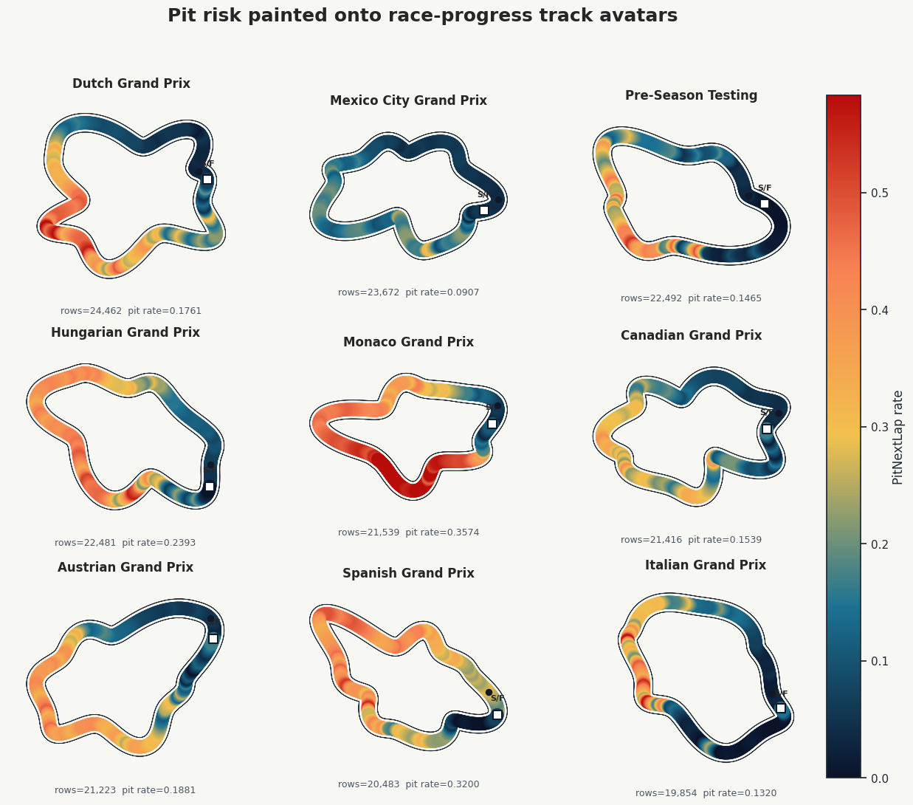
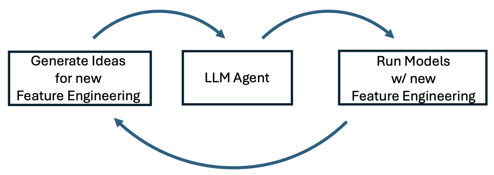

# Playground Series S6E5 - 车辆保险交叉销售（AUC，0.00001 分之差）

> 主题：tabular ｜ 子类：— ｜ 领域：保险（合成数据） ｜ 类别：Playground
> 截止：2026-05-31 ｜ 队伍数：3022 ｜ 机制：标准赛 ｜ 指标：ROC AUC
> 数据来源：`intel/playground-series-s6e5/`（42 条主题索引 + 6 篇 write-up 正文）

## 1. 任务与数据

- 预测目标：二分类 AUC；数据除合成痕迹外**有超出人造 artifact 的真实信号**（需更大深度才能挖到）。
- 决赛圈极限：1st 与 2nd 只差 **0.00001**，且 1st 是截止前最后一分钟的提交。

## 2. 验证方案

- 1st：全程 CV 决策 + 不做任何公开榜探针；对"加 L2 OOF 可能泄漏"的风险处理——留一份不含 L2 OOF 的干净提交对冲。
- 2nd：Agent 自建的 `local_leaderboard.md`（前 10 CV 模型榜）——用文件化榜单管理并行实验。
- 5th：99 模型 logit 栈，fold-wise 拟合 honest OOF、全量重训 5 seeds 平均。

## 3. 模型家族

| 方案 | 使用者层次 | 关键点 | 出处 |
| --- | --- | --- | --- |
| 186 OOF（4 L2 + 182 L1）+ AutoGluon/LR-Logits 50-50 混合 | 1st | 最后 60 秒定胜负 | topic 703562 |
| 自主 Codex YOLO：约 200+ 模型（RealMLP 40、XGB 36、CatBoost 37…） | 2nd | Agent 连续跑实验、自建 CV 榜 | topic 703615 |
| 99 模型 logit 栈（sklearn LR，C=1.0） | 5th | AUC 专用决策：class_weight=None、不做校准 | topic 703572 |
| 5 天冲刺方案 | 4th | 时间预算下的取舍 | topic 703528 |

## 4. 关键技巧

- **Driver 列差异处理**（1st 的突破点）：对抗验证显示 `Driver` 在两套数据间差异最大 → 一组"删 Driver"模型 + 一组不用原数据的模型小幅提升；原数据样本权重 0.5–1 效果相近，降到 0.25 会掉分。
- **L2 OOF 入池的风险管理**：L2 OOF 可能泄漏，但确实有效；策略 = 把它放进主候选 + **保留一份纯 L1 的干净提交**。
- **AUC 的集成细节**（5th）：logit 转换（clip ±30）+ 每模型一列 → LR；AUC 是纯排序指标 → `class_weight=None`、不做任何校准/后处理。
- **Agent 自主实验循环**（2nd）：本地 CV 排行榜文件 + 4×A100 常开 + 并行实验；先攻六大单模 CV，再补多样性第二梯队。Claude/Codex 使用注意：会"过早放弃"与重复生成整本 notebook（1st/2nd 共同反馈）。

## 5. 可迁移性评估

- **可直接迁移**：对抗验证定位差异列并做"删列对照"；L2 OOF 的风险对冲提交；AUC 任务的 logit 栈规范；Agent 实验的 local_leaderboard 协议。
- **需要前提**：多模型 OOF 管理；Agent 工具链与 GPU。
- **不建议照搬**：只看 CV 不慎用 L2 OOF（泄漏会静默传染整个栈）；无对冲地押单一提交。

## 6. 对新手的关键启示

- AUC 类任务的决策规则很简单：**一切优化排序，校准无关**——省掉大量无效后处理。
- 最后关头的"50-50 双集成器混合"常稳过任一单集成器（1st 的最后一分钟验证了它）。
- Agent 很好用，但需要人工把关两件事：它是否过早放弃、它是否在"重复发明"而不是改几行。

## 8. 轻读结论（2026-10 补）

**一句话**：本场标志两件事——**agent 自主实验**（2nd 让 Codex 在 4×A100 上无人值守迭代，218 模型 logit 融合，输 0.00001）与**融合/提交选择决定名次**（1st 最后一分钟 50-50 混合胜出 0.00001；4th 借力他人集成从第 6 升第 4）。

- 1st（703562）：186 OOF；重型 FE；对抗 AUC 显示 Driver 是原数据伪影 → 去 Driver 提分；原数据权重 0.5–1 最好；AutoGluon + LR-logits 50-50 → 私 0.95503。
- 2nd（703615）：Codex 自主循环（local_leaderboard.md）；六大件单模 CV 提升 + 37 类模型；218 模型 cuML LR（logits）融合；无 stacking/伪标签；最佳单模 RealMLP CV 0.954426；换提交输 0.00001。
- 5th（703572）：99 模型 logit 栈（LR，C=1，class_weight=None）；OOF AUC 0.95536；平均 Spearman 0.950；0.918 的 Deep FFM 等正交弱模型贡献最大；原数据当行是唯一稳健 FE。
- 8th（703539）：L5 = 5/7/10 折三种 L4 集成平均；L2→L3 LR→L4 自蒸馏；GPT-5.5 写码 + Gemini 讨论。
- 4th（703528）：5 天从 0.95406 到第 4；小特征集 + HC 集成 + 并入他人集成。

**裁决**：饱和 AUC 赛的公式 = 大 OOF 池 + 低自由度 logit 融合 + 正交弱模型多样性 + 原数据逐列审计 + 谨慎的提交选择；agent 自主实验已可用，但需中间产物与预算约束。

**悬案**：3rd/6th/7th/9th 未细读；原数据不一致成因未细读；agent 成本未量化。

## 9. 图表证据

**图 1**（topic 698434）：赛道头像上的 PitNextLap 目标率（Monaco 0.3574 vs Canada 0.1539）。

**图 2**（topic 703615）：LLM Agent 的"想法→实验→分析"闭环。

## 10. 出处

- 1st：By the skin of my teeth（0.00001 分之胜）：https://www.kaggle.com/competitions/playground-series-s6e5/discussion/703562
- 2nd：Autonomous Codex YOLO：https://www.kaggle.com/competitions/playground-series-s6e5/discussion/703615
- 5th：99 模型 logit 栈与 AUC 决策细节：https://www.kaggle.com/competitions/playground-series-s6e5/discussion/703572
- 4th：5 天冲刺：https://www.kaggle.com/competitions/playground-series-s6e5/discussion/703528
- 8th：L5 Ensemble：https://www.kaggle.com/competitions/playground-series-s6e5/discussion/703539
- 赛道 EDA（54 票）：https://www.kaggle.com/competitions/playground-series-s6e5/discussion/698434
- 原数据不一致（31 票）：https://www.kaggle.com/competitions/playground-series-s6e5/discussion/696380
