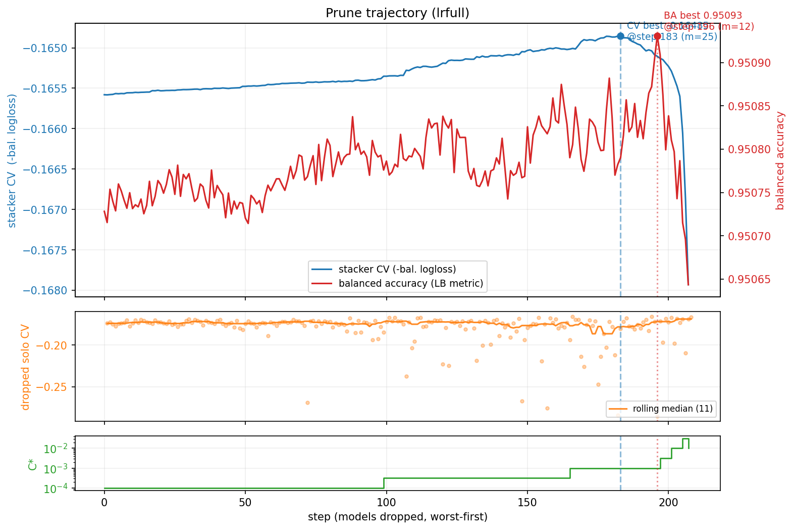

# Playground Series S6E7 - 健康状况多分类（Balanced Accuracy）

> 主题：tabular ｜ 子类：— ｜ 领域：健康（合成数据） ｜ 类别：Playground
> 截止：2026-07-31 ｜ 队伍数：3355 ｜ 机制：标准赛 ｜ 指标：Balanced Accuracy
> 数据来源：`intel/playground-series-s6e7/`（71 条主题索引 + 6 篇 write-up 正文）

## 1. 任务与数据

- 预测目标：三分类健康状况（at-risk 85.9% / fit 5.8% / unhealthy 8.4%），指标为 **Balanced Accuracy**（三类召回的平均）。
- 指标与类别分布的矛盾：普通 argmax 会被 86% 的多数类吸走；均衡指标要求决策层显式校正。

## 2. 验证方案

- 7 折分层 CV + **折内 exact-value 目标编码**（所有目标派生特征只在训练折内拟合）。
- 4th 的选择哲学：公开榜第 414 名（0.95094）、私榜第 4 名（0.95084）——**不因公开榜的微小差异动摇 OOF 判断**（"When the Leaderboard Lied"）。
- 2nd：两步优化全部在 OOF 上完成，测试集直接套用，不碰榜。

## 3. 模型家族

| 方案 | 使用者层次 | 关键点 | 出处 |
| --- | --- | --- | --- |
| FT-Transformer（7 折 × 4 内部成员）+ 先验校正决策 | 4th | 决策规则 > 模型改进 | topic 732487 |
| 18 个基模型 + SLSQP 类权重 + Nelder-Mead 乘子 | 2nd | 数学优化直击指标 | topic 731904 |
| FT-Transformer + exact-value TE | 29th | 同族方案的稳健变体 | topic 732394 |

## 4. 关键技巧

- **先验校正决策规则**（本场最大发现）：把 `argmax(p)` 改成 `argmax(p / class_prior)`——"若各类等概率，样本最像哪类"；OOF Balanced Accuracy 从 **0.89187 → 0.95063**（一行代码的收益 > 一切模型改动）。4th 因此从公开 414 名到私榜第 4。
- **SLSQP 类特定权重**（2nd）：对 18 个模型 × 3 类的 54 个权重在单纯形约束下直接最小化 OOF LogLoss；FT-Transformer 拿到最大权重（0–2 类分别 71.8%/62.5%/50.3%），XGB-OvR 互补。
- **Nelder-Mead 类乘子**：对 OOF 调出类概率乘子 [0.124, 1.500, 1.250]，测试集原样套用（0.889 → 0.951）。
- **exact-value 目标编码**：对多分类为每个原始值编码完整 3 类概率分布（13 特征 → 39 个 TE 特征），折内拟合。
- 反堆叠：4th 的最终提交没有跨模型堆叠——单族模型 + 正确决策规则足够。

## 5. 可迁移性评估

- **可直接迁移**：均衡指标的先验/乘子校正决策（任何不平衡多分类任务）；用 OOF 做权重与乘子的数学优化（SLSQP/Nelder-Mead）；exact-value TE 的多分类形式；"公开榜微差不动摇 OOF"的纪律。
- **需要前提**：训练与测试同分布（合成 Playground 成立）；OOF 干净无泄漏。
- **不建议照搬**：不做决策层校正直接用 argmax 交均衡指标任务；用测试标签/榜反馈调乘子（2nd 强调全程只用 OOF）。

## 6. 对新手的关键启示

- **先对齐指标再动模型**：本场第一名与第四名的共同结论——决策规则比网络结构重要得多。
- 类别极不平衡 + 均衡指标 = 必做先验校正；这是一行代码，却是 0.06 分的差距。
- 公开榜名次可以骗人（414 → 4），OOF 不会——前提是你的 OOF 折内干净。

## 7. 轻读结论（2026-10 补）

**一句话**：Balanced Accuracy + 极端类别不平衡（85.87%/5.77%/8.36%）下，**决策规则对齐指标是最大单点增益**：`argmax(p)` → `argmax(p/class_prior)` 让 4th 的 OOF BA 从 0.89187 升到 **0.95063**，并把他从公榜 #414 送到私榜 **#4**（分数只变 -0.0001）。

- 4th（732487）：FT-Transformer，7 折 × 每折 4 个独立初始化成员；13 原始 + **39 个多分类精确值目标编码**（折内拟合）；**先验校正决策**；结论="让决策规则对齐指标，再信任干净 OOF"。
- 2nd（731904）：18 个异构基模型；**SLSQP 单纯形约束的类特定权重（18×3=54 参数，最小化 OOF LogLoss）**：0.105495→0.086310；不做非线性元学习；**Nelder-Mead 类乘子 [C0 0.1240, C1 1.4998, C2 1.2502]** 只在 OOF 上调、测试端原样应用 → BA 0.889132→0.950737；FT-Transformer 权重最大（三类 71.81%/62.45%/50.28%）。
- 29th：FT-Transformer + exact-value TE；社区"一个配置从 0.903→0.950"、"86% 准确率只得 0.33"。
- 社区：Trust your CV（27 票）、Rank11 剪枝轨迹（22 票）、9 notebook 研究轨迹（19 票）。

**裁决**：不均衡 + BA/F1 类指标先做先验/乘子校正；精确值 TE + FT-Transformer 是强组合；用 OOF 选提交而非公榜前列微差；融合时同时盯 logloss 与目标指标。

**悬案**：**1st 方案未入库**；3rd/5th–10th 缺失；生成模型帖未细读。

## 8. 图表证据

**图 1**（topic 731729）：剪枝过程中平衡 logloss 与 BA 的双轨（BA 峰值 0.95093）、被剪成员的 solo CV 分布、正则系数 C* 的阶梯变化。

## 9. 出处

- 4th：信任 OOF（先验校正决策规则）：https://www.kaggle.com/competitions/playground-series-s6e7/discussion/732487
- 2nd：CV 与数学精度（SLSQP + Nelder-Mead）：https://www.kaggle.com/competitions/playground-series-s6e7/discussion/731904
  - 29th：FT-Transformer + exact-value TE：https://www.kaggle.com/competitions/playground-series-s6e7/discussion/732394
  - Trust your CV（27 票）：https://www.kaggle.com/competitions/playground-series-s6e7/discussion/718258
  - Rank11 approach（22 票）：https://www.kaggle.com/competitions/playground-series-s6e7/discussion/731745
  - 9 notebook 研究轨迹（19 票）：https://www.kaggle.com/competitions/playground-series-s6e7/discussion/719199
  - 为什么 86% 准确率只得 0.33（8 票）：https://www.kaggle.com/competitions/playground-series-s6e7/discussion/717018
- 轻读全本：`analysis/deep/playground-series-s6e7.md`（Tier B 轻读：对照矩阵/裁决/证据分级/悬案 + 1 图证）
