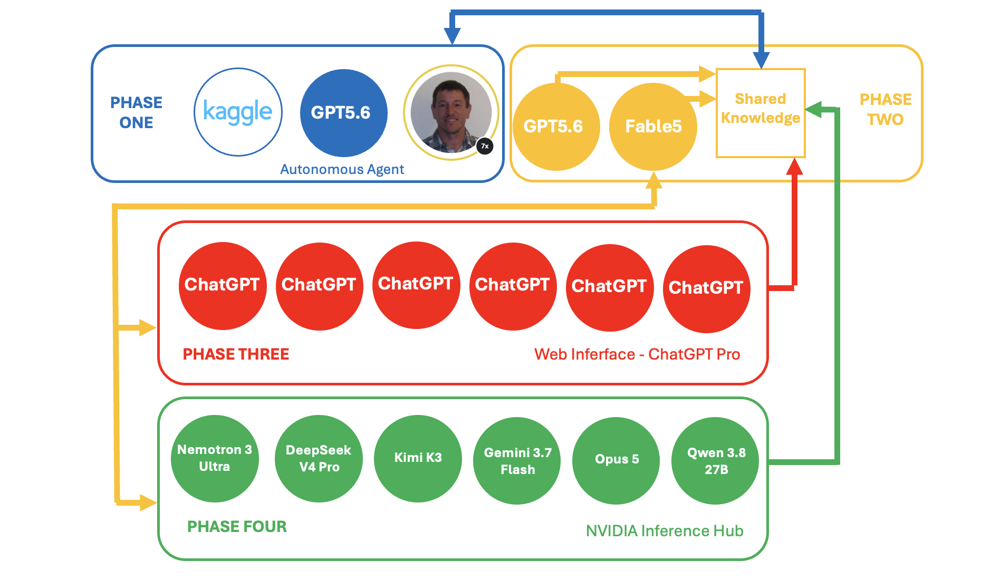
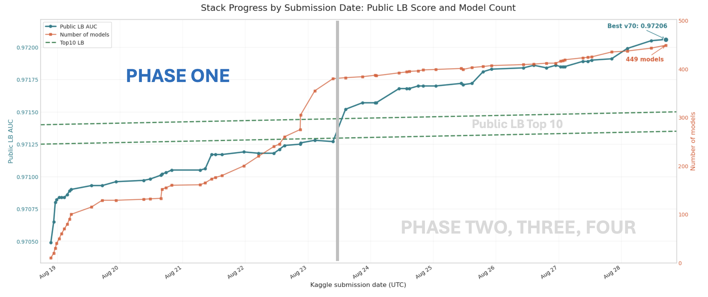
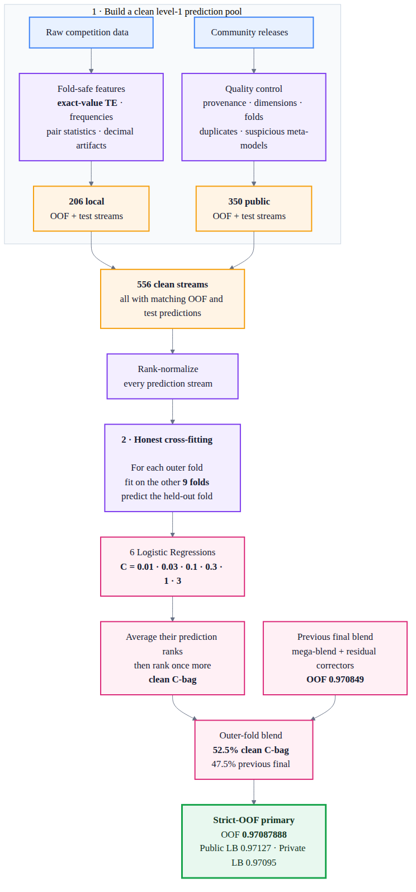

# Playground Series S6E8 - 保险交叉销售预测（Agent 蜂群夺冠）

> 主题：tabular ｜ 子类：— ｜ 领域：保险（合成数据） ｜ 类别：Playground
> 截止：2026-08-31 ｜ 队伍数：3531 ｜ 机制：标准赛 ｜ 指标：ROC AUC
> 数据来源：`intel/playground-series-s6e8/`（63 条主题索引 + 6 篇 write-up 正文）

## 1. 任务与数据

- 预测目标：客户是否会购买车险（二分类 AUC）；合成数据。
- 关键节点：1st 的**单模型直接夺冠**（无需集成）——这是 Playground 系列 18 个月内首次单模型登顶（上次是 S5E2）；说明前沿 LLM 智能体已能独立完成顶级特征工程与调参。

## 2. 验证方案（社区协作的新高度）

- 固定 StratifiedKFold(5, seed=42) 一次性生成、提交后不再重生成——所有人共享同一折文件。
- 14th 的"密封折判决"流程：每轮池子变更 = 封 1 折、在其余 4 折上做全部选择、在封存折评分，重复 5 次；采纳条件为**预设增益 + 5/5 折为正**；公开榜不参与任何决策。
- **社区 OOF 图书馆**（14th 的核心资产）：278 组他人公开发布的 OOF/预测在通过完整性检查后入池——行数、有限值、重打分 AUC 与声明值差 <1e-5、哈希去重、折证据、泄漏审查；组合器为标准化秩+logit 的 L2 逻辑回归（C=0.03），允许负权重。

## 3. 模型家族

| 方案 | 使用者层次 | 关键点 | 出处 |
| --- | --- | --- | --- |
| 4 阶段 agent 演进：单 agent → 双 agent 竞赛 → ChatGPT Pro → NVIDIA Inference Hub 蜂群 | 1st | 380 模型自动集成；单模型 RealMLP CV 0.97070 夺冠 | topic 738592 |
| 手工工作流：第 1 周 100–200 基础模型矩阵 | 2nd | RAW + 特征组 + 原数据（行/列/无）三态枚举 | topic 738856 |
| 36 自有 + 278 共享预测的 logistic 栈 | 14th | 密封折判决 + 完整性检查 + 署名清单 | topic 739004 |
| 秩对齐融合与风险条件混合 | 248th | 低名次视角的稳健融合 | topic 738626 |

## 4. 关键技巧（1st 的 agent 工程学）

- **单 agent 全自动阶段**：Codex 智能体自行读题、下载数据、每积累 10–50 个模型就重算集成 CV 并自动提交——4 天建成 380 模型集成。
- **双 agent 竞赛**：让 GPT 5.6 Sol 与 Fable 5 分别攻"最好单 NN / 最好单 XGB"，落后方向领先方取经——**竞赛 + 适度共享**产出冠军单模型。
- **ChatGPT Pro 分包求解**：把代码与提示打包人工投喂，2 小时并行返回发现包；据称发现了该 Grandmaster 8 年未见过的表格特征工程思路。
- **NVIDIA Inference Hub 蜂群**：从约 150 个 LLM 中面试筛选（Nemotron 3 Ultra、DeepSeek V4 Pro、Kimi K3、Qwen 3.8……）并派工。
- 2nd 的教训（人类视角）：把时间花在 blender 上不如**把最强单模推到底**；公开预测的真实多样性超过自己造的多数模型；"Chris 领先不是因为他有秘密 blender"。

## 5. 可迁移性评估

- **可直接迁移**：单折文件 + 密封折判决；OOF 共享池的完整性检查清单；"RAW + 特征组 + 原数据三态"的实验矩阵；agent 分工（竞赛/审查/取经）协议。
- **需要前提**：多 agent 工具链、多模型算力、社区共享氛围；密封折流程需要自律。
- **不建议照搬**：无检查直接吃公开 OOF（泄漏与噪声风险）；盲目跟风"agent 越多越好"（本场是精心设计的分工）。

## 6. 对新手的关键启示

- 本场浓缩了 2026 年的两个趋势：**单模型价值回归**（特征工程决定上限）与**智能体工程化**（流程设计决定产出速度）。
- 2nd 的建议朴素有效：想进前 500，先把已结束的 AUC 场（S5E8/S5E11/S6E3/S6E5）练一遍，理解"哪些 FE 反复有效、哪些 blender 稳定、OOF/LB 关系如何"。
- 社区资产（公开 OOF、共享折）用好了是杠杆——但要先学会写"准入检查"。

## 8. 轻读结论（2026-10 补）

**一句话**：本场是 **agentic data science 的里程碑**——1st 用 Codex 自主跑 4 天建成 380 模型集成，再让 GPT-5.6 与 Claude Fable 5 互相对战/分享，产出**单独夺冠的模型**（18 个月来首次单模夺冠），随后又把 ChatGPT Pro 与 ~150 个 LLM 组织成分布式智能；技术侧主信号是**合成生成器伪影**（exact-value/stringified TE）。

- 1st（738592）：四阶段 agent 流程；单模 RealMLP CV 0.97070/LB 0.97174；最终 449 模型、公榜 0.97206。
- 2nd（738856）：四周流程；`fake_daily = social+work+game` 等反推特征；用 200+ 公开预测；私榜 0.97123；建议练旧赛、别调公榜。
- 7th（738650）：556 条预测流（206 本地 + 350 公开）；**exact-value TE 9 列 +0.00191**；6 LR 秩平均；OOF 0.97088 / 公 0.97127 / 私 0.97095；bootstrap 95% CI [+0.000020, +0.000039]。
- 14th（739004）：36 自训 + 278 共享 OOF；密封折嵌套 OOF + 5/5 折门槛 + 完整性检查（重算 AUC <1e-5、哈希去重、许可证清单）；公榜零决策；私榜 0.97109。
- 233rd（738691）：对抗验证 AUC 0.5654；TE 晶格（二三元组合）；177 成员栈 + 锚流；结论：树模型饱和、顶部靠 GPU NN。
- 社区：starter CV 0.96（24 票）、生成缺失原始数据（21 票）、stringified TE（9 票）。

**裁决**：先逆向生成器伪影，再用严格验证协议（密封折/嵌套 OOF）和大规模共享 OOF + 线性融合；agent 群体编排已是顶级竞争力的组成部分。

**悬案**：1st 的 agent 成本与新 FE 细节未公开；3rd–6th/8th–13th 未收录。

## 9. 图表证据

**图 1**（topic 738592）：单 agent → 双 agent 竞争 → ChatGPT Pro → LLM 群体的四阶段架构。

**图 2**（topic 738592）：公榜分数与模型数随提交日期的增长（最终 449 模型、0.97206）。

**图 3**（topic 738650）：556 条清洗流 → 9 折拟合/1 折评估 → 6 LR → 秩平均 → 外层混合。

## 10. 出处

- 1st：Distributed Intelligence（agent 四阶段）：https://www.kaggle.com/competitions/playground-series-s6e8/discussion/738592
- 2nd：夯实单模、善用公开预测的反思：https://www.kaggle.com/competitions/playground-series-s6e8/discussion/738856
- 14th：278 组共享 OOF + 密封折判决：https://www.kaggle.com/competitions/playground-series-s6e8/discussion/739004
- 7th：太多模型，一个简单堆叠：https://www.kaggle.com/competitions/playground-series-s6e8/discussion/738650
- 233rd：https://www.kaggle.com/competitions/playground-series-s6e8/discussion/738691
- 简单 XGB/EDA starter（24 票）：https://www.kaggle.com/competitions/playground-series-s6e8/discussion/736409
- 生成缺失原始数据集（21 票）：https://www.kaggle.com/competitions/playground-series-s6e8/discussion/732428
- stringified TE + 秩平均（9 票）：https://www.kaggle.com/competitions/playground-series-s6e8/discussion/734063
