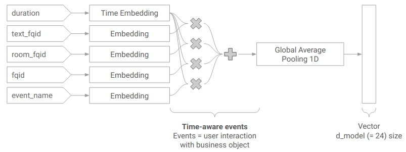
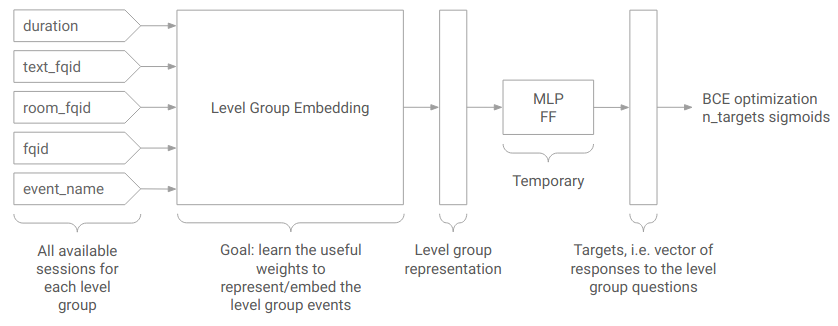
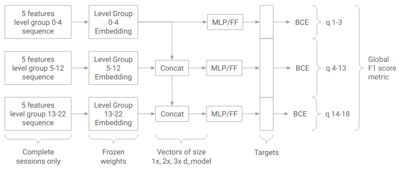
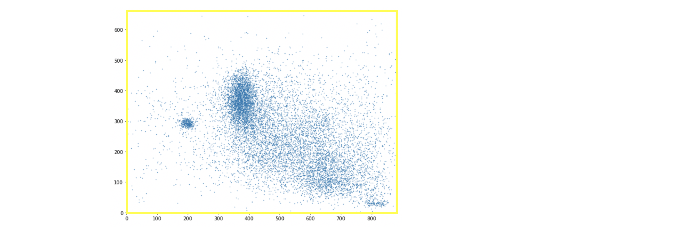

# Predict Student Performance from Game Play

> 主题：tabular（行为日志）｜ 子类：— ｜ 领域：教育 ｜ 类别：Featured
> 截止：2023-06-28 ｜ 队伍数：2051 ｜ 机制：代码赛 ｜ 指标：Macro F-Score（18 个二分类问题）
> 数据来源：`intel/predict-student-performance-from-game-play/`（120 条主题索引 + 8 节正文：1st×2/4th/7th/9th/13th + 开局 EDA + 攻略；24 条 write-up 标记中其余未收录）

## 1. 任务与数据

- **预测目标**：由学生在教育游戏中的**操作日志**（事件流、坐标、时间）预测 18 个二分类标签（是否答对/是否完成等）。
- **数据形态**：长事件序列按 session 组织，规模大、噪声高；评测指标是宏平均 F1，**阈值选择对分数影响极大**。
- **构造陷阱：本场存在数据泄漏争议**。参赛者主动上报了测试数据泄漏问题（社区有 "Update on Leaked Competition Data"、"Is Test Data Leak Intentional or Accidental?" 等高票讨论），冠军在 write-up 中专门感谢主办方处理泄漏上报。
- **泄漏时间线**：1st 在 OpenGameData 开放门户重建了 98% 训练会话与约 7000/11500 个 LB 会话 → 上报 → 主办方更新数据并释放 LB 数据 → 又发现残余泄漏再次上报；**补充数据（合法）与被撤回的 LB 泄漏（违规）被严格分开**。
- **私有测试规模（探针）**：私榜 = API 前 1450/1500 个会话；<2000 极噪，5000 才稳定 CV-LB 对齐。

## 2. 验证方案

| 方案 | 使用者 | 说明 |
| --- | --- | --- |
| 只用 Kaggle 提供的数据做验证 | 4th | 训练用全量原始数据，验证只在与评测同源的数据上做 |
| 10 袋 × 5 折的重复验证 + 噪声阈值筛选 | 1st | **特征只有在 CV 均值超过"量化后的噪声水平"时才保留** |
| 共识策略 | 1st | 神经网络侧用多数/共识方式确认选择，降低随机性影响 |
| 多种子/多重复/嵌套 | 4th/7th/13th | 3 seeds、4 折×3 重复、按 session_id 前缀嵌套 CV |

## 3. 方案谱系

| 方案 | 名次 | 关键点 |
| --- | --- | --- |
| XGBoost + Conv1D NN（TimeEmbedding/时间感知事件），50/50 融合 | 1st | 噪声门槛 0.0003 + 10 bags + 4/5 折共识；两级训练（全数据预训练→冻结→端到端）；TF Lite 6× |
| Transformer/XGB/Cat + **线性回归元模型（含未来问题概率）** | 4th | 原始数据 ~58k 会话训练、只用 Kaggle 数据验证；阈值三提交 |
| 3×LGBM（按 level_group）+ 六键时长特征 | 7th（效率第 1） | 原始数据 +0.002；4 折×3 种子；3 分钟推理 |
| 逐问题 LGB+Cat 平均 + **checkpoint 特征** | 9th | 3009/9747/18610 特征；top-500 逐折；前序概率 +0.001 |
| LGBM + Transformer+GRU（0.66/0.34） | 13th | 嵌套 CV（session_id 前缀切分） |

## 4. 关键技巧

- **噪声门槛协议**：10 bags×5 折均值 > 0.0003 才准入；NN 用 4/5 折共识。
- **时间特征族**：duration+counts 多聚合（1st）；六键 groupby 时长求和（7th）；必经事件 checkpoint 间隔（9th）。
- **时间感知事件**：`duration×(event+room+text+fqid)` + TimeEmbedding（4× ConvBlock）。
- **两级训练**：全数据（含未完成会话）预训练 backbone → 冻结 → 端到端头部（1×/2×/3× d_model 随问题组加宽）。
- **阈值纪律**：全局 0.625（逐问题不稳）；提交层面小幅对冲（4th 三阈值）。
- **效率工程**：TF Lite ≥6×、Treelite 2×、lleaves；400k 参数 NN；效率提交 3–5 分钟。
- **泄漏伦理**：发现→上报→等处置；不利用被撤回数据。

## 5. 深读结论（2026-10 补）

- **本场是"领域信号 + 实验纪律"**：时长/间隔是阅读能力的因果代理；分差来自谁能把它聚合对（1st 的 3 千级特征/组、7th 的六键、9th 的 checkpoint）。
- **噪声量化到 0.0003 的门槛**是第一方法论：10 bags + 共识折把"CV 涨 0.000x"的噪声挡在门外；私有测试仅 1450 会话让这条纪律成为必需。
- **两级训练让 400k 参数 NN 达到 GBDT 水平**（0.70175 vs 0.7025），50/50 融合 → 0.705；NN 的价值在互补性。
- **阈值是宏 F1 的第二半**：全局 0.625 更稳；4th 的三阈值提交是低成本对冲。
- **泄漏事件的处置模板**：1st 的上报-等待-重评流程证明"合法补充数据"与"违规 LB 泄漏"可以分开；效率侧信道（前 N 会话计时）存在但被主动放弃。

## 6. 图表证据

**图 1：时间感知事件**（1st，topic 420217）——`../../intel/predict-student-performance-from-game-play/bodies/420217_img/03.png`

*读图*：duration→TimeEmbedding、四类类别→Embedding；逐元素相乘后求和→GAP→24 维。

**图 2：预训练阶段**（1st）——`../../intel/predict-student-performance-from-game-play/bodies/420217_img/05.png`

*读图*：全部可用会话（含未完成）训练 level_group embedder + 临时 MLP 头（BCE）。

**图 3：端到端阶段**（1st）——`../../intel/predict-student-performance-from-game-play/bodies/420217_img/06.png`

*读图*：冻结 embedder；q1-3 用 1×、q4-13 用 2×、q14-18 用 3× 拼接 → BCE + 全局 F1。

**图 4：开局点击 EDA**（Chris Deotte，topic 387864）——`../../intel/predict-student-performance-from-game-play/bodies/387864_img/04.png`

*读图*：11.5k 用户首次点击的屏幕坐标簇（黄框=弹窗）——行为特征（位置/停顿）来源。

## 7. 可迁移性评估

- **可直接迁移**：
  - **把 CV 噪声量化为特征准入阈值**（适用于任何噪声大的比赛）。
  - 时长/间隔类特征在行为日志任务中普遍有效。
  - 宏平均指标必须显式优化每类阈值。
  - 只在与评测同源的数据上验证。
- **需要前提**：
  - 需要大规模事件日志的处理能力（内存/时间）。
- **不建议照搬**：
  - 利用泄漏数据（本场社区选择上报，且规则上通常被禁）。

## 8. 对新手的关键启示

1. **特征是否有效，要用噪声水平来判断**，而不是"CV 涨了 0.000x 就加"。
2. **行为日志类任务先做时间特征**。
3. **阈值是宏平均指标的一半工作**。
4. **发现数据泄漏应上报**——这既是规则要求，也是社区信任的基础。

## 9. 出处

- 讨论区索引：`intel/predict-student-performance-from-game-play/topics.md`（120 条）
- 已收录正文（8 节）：
  - 开局 EDA（Chris Deotte，228 票）：https://www.kaggle.com/competitions/predict-student-performance-from-game-play/discussion/387864
  - 游戏攻略（pjmathematician，212 票）：https://www.kaggle.com/competitions/predict-student-performance-from-game-play/discussion/384796
  - 1st（Bertrand P，168 票）：https://www.kaggle.com/competitions/predict-student-performance-from-game-play/discussion/420217
  - 7th/效率第 1（Jack，102 票）：https://www.kaggle.com/competitions/predict-student-performance-from-game-play/discussion/420119
  - 9th（Makotu，81 票）：https://www.kaggle.com/competitions/predict-student-performance-from-game-play/discussion/420046
  - 1st 代码（67 票）：https://www.kaggle.com/competitions/predict-student-performance-from-game-play/discussion/420332
  - 13th（Takoi，52 票）：https://www.kaggle.com/competitions/predict-student-performance-from-game-play/discussion/420077
  - 4th（Joel Erikanders，48 票）：https://www.kaggle.com/competitions/predict-student-performance-from-game-play/discussion/420349
- 未收录缺口（登记备查）：24 条 write-up 标记中的其余条目；泄漏事件两帖（396202/388479）亦未收录
- 深读全文：`analysis/deep/predict-student-performance-from-game-play.md`
