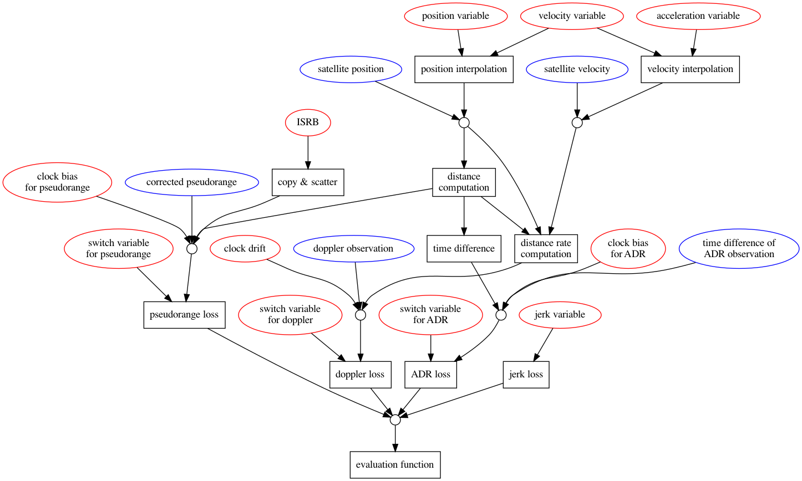

# Smartphone Decimeter Challenge 2022（精简）

> 主题：tabular（GNSS 定位）｜ 子类：— ｜ 领域：导航定位 ｜ 类别：Research ｜ 截止：2022-07-29 ｜ 队伍数：573 ｜ 指标：定位误差（分米级）
> 出处：`intel/smartphone-decimeter-2022/`（80 条主题索引 + 6 篇 write-up 正文）

## 任务

由智能手机的 GNSS 原始观测（伪距、载波相位等）估计高精度位置（分米级），是"**经典方法强于 ML**"的典型领域。

## 关键要点

- 5th 的观察很关键：他"担心比赛吸引不到人，因为**机器学习在上一届 GNSS 数据上效果并不好**"，但最终竞争水平很高——说明**信号处理/几何方法 + 少量 ML 修正**是本题主流。
- 与常规 Kaggle 赛不同：**领域标准方法（RTK/PPP 类算法）本身就是强基线**。
- 手机 GNSS 的挑战在于噪声项复杂（多径、电离层、硬件偏差）。

## 可迁移要点

- **先确认"领域经典方法 vs ML"的力量对比**：某些领域（定位、信号处理、控制）经典算法仍占优。
- ML 的合理位置是**残差修正/噪声建模**，而非端到端替换。
- 与 Ventilator、G2Net、IceCube 对照：**"物理/经典方法打底、ML 做增量"是稳健路线**。

## 轻读结论（2026-10 补）

**一句话**：物理优化（因子图/最小二乘）+ 基站差分 + ADR/多普勒融合的 GNSS 定位赛；ML 不是主力，数据质量与机型细节决定成败。

- 1st（72 票，连冠）：GTSAM FGO **两阶段**（先多普勒估速度→再伪距+ADR+速度约束估位置）；Huber M-估计；全测试 ~30 分钟；机型修正（Mi8 多普勒 600ms 偏移、S20/Mi8 用仰角误差模型、Pixel4 周跳）；赛后修基站坐标偏移补交公 1.372/私 1.197。
- 5th（44 票）：TensorFlow 自定义全局优化（增广拉格朗日），状态含 jerk，伪距/多普勒/ADR 全加 switchable constraints；UNAVCO/IGS MGEX/NGL/电离层外部数据；不用 ML/IMU。
- 论证：ADR 是分米级前提（Pixel4 部分 run 不可用）；GT 错误/测试区域差异等数据硬伤（39 票帖）。

**失败学**：加速度计积分、学习调 Huber 参数、tightly-coupled 逐卫星优化（1st）。

**悬案**：2nd/4th 未收录；官方对 GT/基站偏移的回应未收录。

## 图表证据

**图 1**（topic 340692）：变量/常量/四类损失（伪距、多普勒、ADR、jerk）→ 评价函数。

## 出处

- 讨论区索引：`intel/smartphone-decimeter-2022/topics.md`
- 1st（72 票）：https://www.kaggle.com/competitions/smartphone-decimeter-2022/discussion/341111
- 5th（44 票）：https://www.kaggle.com/competitions/smartphone-decimeter-2022/discussion/340692
- 轻读全本：`analysis/deep/smartphone-decimeter-2022.md`（Tier B 轻读：对照矩阵/裁决/证据分级/悬案 + 1 图证）
