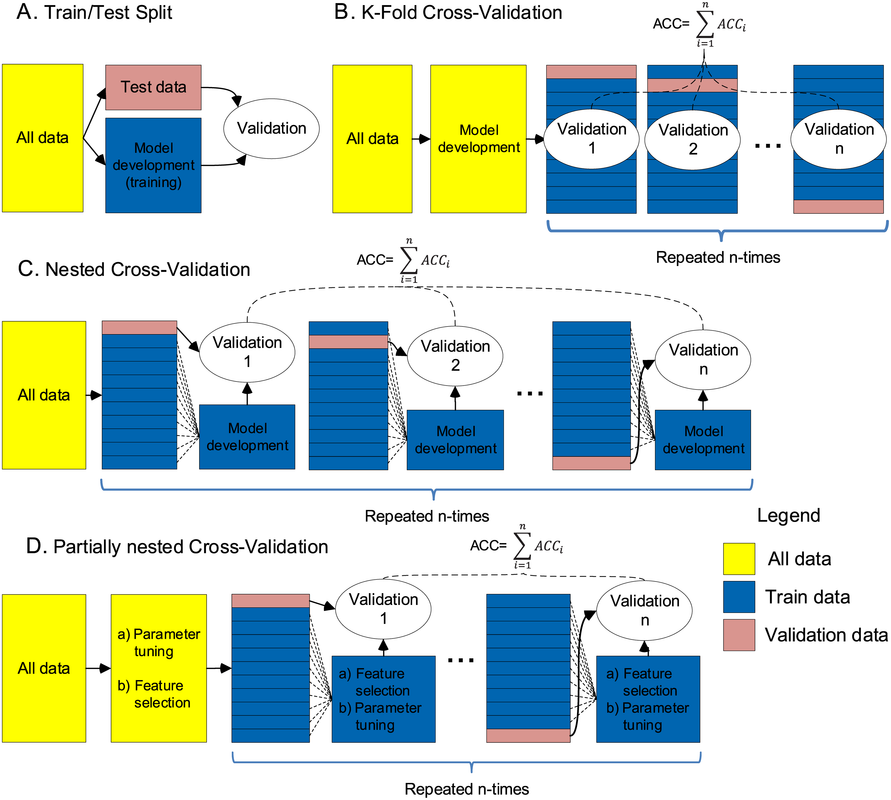

# Tabular Playground Series - Feb 2022（细菌分类，随机数生成缺陷的泄漏）

> 主题：tabular ｜ 子类：— ｜ 领域：生物（合成数据 + 注入泄漏） ｜ 类别：Playground
> 截止：2022-02-28 ｜ 队伍数：1255 ｜ 机制：标准赛 ｜ 指标：Categorization Accuracy
> 数据来源：`intel/tabular-playground-series-feb-2022/`（80 条主题索引 + 6 篇 write-up 正文）

## 1. 任务与数据

- 背景：原始论文"在 10 种细菌上训练、在 10 种突变菌上测试"，主办方为复现分布差异故意注入了 train/test 漂移。
- **生成缺陷（本场核心）**：训练与测试用同一个 `np.random.RandomState(seed)` 的 `choice()` 生成序列，只是**概率数组略有不同**——`choice` 内部先生成均匀随机数再 `cdf.searchsorted`，因此相近的 p 产生"几乎一样"的序列（示例中 30 位仅 3 位不同）。→ train/test 不独立。
- 数据规模事实：训练集 38% 是重复行（约 7.6 万），测试集约 25% 重复；数百训练行直接出现在测试集中。

## 2. 验证方案

- 关键诊断信号：**正确去重后的 CV 分数显著低于公开 LB 分数** → 存在泄漏（这种"LB > CV"的背离是泄漏的常见指纹）。
- 修复数据口径：先按 `row_id` 去重再划分/评估（不去重会虚高）；嵌套 CV（Double Cross-Validation）帖子提供防过拟合的评估框架。
- **定量确证（深读新增）**：官方示例中两概率向量 Σ|Δp|=0.20 → TV 距离 = 0.10；长度 30 的序列期望失配 = 30×0.10 = **3 位**，与示例观察到的 3 处不同完全吻合——"近重复"是生成机制的必然结果，而非偶然。

*图：Train/Test Split vs K-Fold vs Nested CV vs Partially Nested CV（`intel/.../305350_img/08.png`）——本场前提是先去重，嵌套 CV 用于避免"用泄漏修补泄漏"的二次过拟合。*

## 3. 模型家族

| 方案 | 使用者层次 | 关键点 | 出处 |
| --- | --- | --- | --- |
| 定制变换 + 半径近邻 | 1st | 286 个 decamer 计数→还原为 100 个 decamer 序列，再用 RadiusNeighborsClassifier 把 test 行匹配到 train 配对 | topic 310359 |
| 6 模型投票（含 **EMD** 直方图距离） | 2nd | 欧氏/曼哈顿粗筛 30 近邻 → 再用 Earth Mover's Distance 细排；曼哈顿优于欧氏 | topic 310367 |
| ExtraTrees 基线 | 社区 | 去重后 CV 明显低于 LB | topic 310359 |
| 去重 38% 训练数据的效率优化 | 社区 | 数据清洗与加速 | topic 305364 |
| 嵌套交叉验证 | 社区 | 评估纪律 | topic 305350 |

## 4. 关键技巧

- **泄漏侦查三段式**（可复刻）：① 对抗验证发现分布差异（本场是"故意"的）；② 发现"LB 明显高于去重后 CV"；③ 找到生成代码中的机制（同种子 + 相似概率 → 近似序列），构造让"同种子近邻"距离变小的变换与度量。
- 去重优先：`index_col=row_id` 后 `duplicated()`；注意"把索引留在列里"会检测不到重复（唯一索引）。
- 一旦暴露机制，目的性建模（而非通用分类器）才是最优——ExtraTrees 只是"顺带受益者"。
- **失配率 = TV 距离**：同 seed 下两条 CDF 之间的缝隙质量恰为总变差距离；每行期望失配位数 ≈ 序列长度 × TV——据此可预判近重复密度（深读推演）。
- 1st 引 Knuth《TAOCP》Algorithm K 的教训收尾：*"随机数不应以随便挑的方法生成"*——事故根源一句话。

## 5. 可迁移性评估

- **可直接迁移**：LB>CV 背离作为泄漏指纹；数据去重流程（含索引陷阱）；从生成代码/种子机制反推数据结构；嵌套 CV 纪律。
- **需要前提**：能读数据生成逻辑（或社区已公开）；评估口径先修正。
- **不建议照搬**：把"利用泄漏"当常规技术（本场是组织方失误型泄漏）；不去重直接调模型。

## 6. 对新手的关键启示

- **先修正评估口径，再开始竞争**：本场不去重的话 CV 完全失真。
- LB 与 CV 的"高低关系异常"是重要信号：LB 明显高 → 泄漏；明显低 → 分布迁移。
- 阅读数据生成代码/库源码是最高杠杆的侦查动作（参见 Jul 2022 的同类结论）。

## 7. 出处

- 1st：利用随机数生成缺陷：https://www.kaggle.com/competitions/tabular-playground-series-feb-2022/discussion/310359
- 去重 38% 训练数据的实操：https://www.kaggle.com/competitions/tabular-playground-series-feb-2022/discussion/305364
- 嵌套交叉验证（Double CV）：https://www.kaggle.com/competitions/tabular-playground-series-feb-2022/discussion/305350
