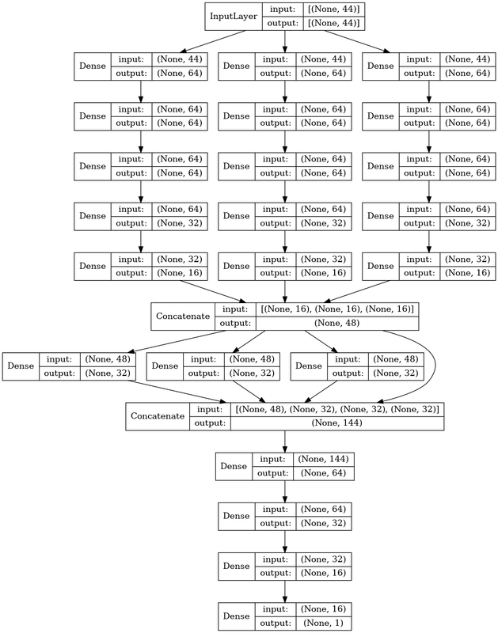

# Tabular Playground Series - May 2022（AUC，特征交互图的图论应用）

> 主题：tabular ｜ 子类：— ｜ 领域：—（合成数据） ｜ 类别：Playground
> 截止：2022-05-31 ｜ 队伍数：1151 ｜ 机制：标准赛 ｜ 指标：ROC AUC
> 数据来源：`intel/tabular-playground-series-may-2022/`（68 条主题索引 + 6 篇 write-up 正文）

## 1. 任务与数据

- 官方提示直指主题："数据包含大量特征交互，本赛是探索交互识别与利用的机会"。
- 关键探索链：社区用 **Xgbfir** 输出全部交互 → 把交互画成图 → **图有两个连通分量**——交互只发生在分量内部。

## 2. 验证方案

- 常规 CV；交互约束的正确性由 LB 与 CV 同步验证（1st 的两分支网络与 LGBM 约束对照）。

## 3. 模型家族

| 方案 | 使用者层次 | 关键点 | 出处 |
| --- | --- | --- | --- |
| 两分支网络（按交互图连通分量分组输入） | 1st | 限制交互自由度 | topic 328336 |
| LGBM `interaction_constraints` | 1st | 同一思路的树版（0.99778） | topic 328336 |
| 三投影区域特征（ternary） | 社区 | 人工编码交互边界 | topic 323892 |

## 4. 关键技巧

- **交互图 → 架构约束**（本场灵魂）：把特征交互视为图，网络/树只在**连通分量内部**允许交互——"其他交互只会产生噪声"。两分支网络即该思路的落地；LGBM 的 `interaction_constraints` 是同一思想的现成超参。
- **投影区域特征**（ambrosm）：对关键二维投影（f_02×f_21、f_05×f_22、f_00+f_01×f_26）划出三区域（高/中/低概率）标记为 +1/0/−1 的类别特征，等于把"人工发现的决策边界"直接喂给模型。
- 交互发现工具链：Xgbfir 输出 + 可视化 → 图结构 → 约束。

## 5. 可迁移性评估

- **可直接迁移**：交互图/连通分量分析；`interaction_constraints` 用法；投影区域特征；"用工具找交互、用结构图表达交互"的流程。
- **需要前提**：特征交互可被工具量化（GBDT 已训练）；投影维度可控（2D）。
- **不建议照搬**：无约束地让深度网络自由学习所有交互（本场被证明是噪声源）。

## 6. 对新手的关键启示

- "特征交互"可以用图论表达与约束：先找交互、再画图、后限架构——比"让模型自己学"更可控。
- LGBM 的 `interaction_constraints` 是被低估的现成工具。
- 官方提示就是赛题主线：读题时把每个暗示记下来。

## 8. 轻读结论（2026-10 补）

**一句话**：官方提示"包含大量特征交互"就是赛题主线：社区用 XGBFIR 找出交互图的**两个连通分量**，1st 用**两分支网络**把交互限制在分量内（LGBM `interaction_constraints` 也能到 0.99778）；71 票帖把三大交互工程化为 −1/0/+1 三值特征；分数高度饱和（前列 0.998+），4th 直言"很快就失去兴趣"。

- 1st（328336）：二分支网络（左/右分量 + f_27 字符列 + unique_characters + 三个工程交互）；与公开 Advanced Keras 基本一致。
- 三大交互（323892）：`i_02_21`、`i_05_22`、`i_00_01_26`（阈值化三值）。
- 4th（328441）：多分支多激活（swish/selu/relu）网络私 0.99822；与公开 notebook 50-50 → 0.99825。
- 5th（328553）：CatBoost Langevin（depth 8 + 大正则）+ Keras 融合。
- 541th（328355）：f_27 拆 10 列；回归 clip(0,1) 0.97952 vs 分类 0.92500；曾误用 RMSE 指标。

**裁决**：官方提示优先；交互结构显式建模（分支/约束/三值特征）；短字符串拆字符列；AUC 用回归概率输出；饱和分数下重工程细节。

**悬案**：2nd/3rd 未收录；f_27 含义未定论。

## 9. 图表证据

**图 1**（topic 328441）：三路多激活分支网络。

## 10. 出处

- 1st：两分支网络与交互图：https://www.kaggle.com/competitions/tabular-playground-series-may-2022/discussion/328336
- 手工工程化前三大交互（三区域特征）：https://www.kaggle.com/competitions/tabular-playground-series-may-2022/discussion/323892
- 4th：多激活分支：https://www.kaggle.com/competitions/tabular-playground-series-may-2022/discussion/328441
- 5th：CatBoost + Keras：https://www.kaggle.com/competitions/tabular-playground-series-may-2022/discussion/328553
- 541th 复盘（回归 vs 分类）：https://www.kaggle.com/competitions/tabular-playground-series-may-2022/discussion/328355
- Interaction vs Correlation（53 票）：https://www.kaggle.com/competitions/tabular-playground-series-may-2022/discussion/323766
