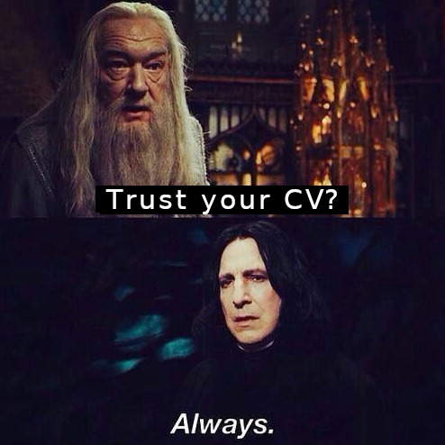

# Tabular Playground Series - Nov 2021（AUC，"不要相信 CV"的极端案例）

> 主题：tabular ｜ 子类：— ｜ 领域：—（合成数据 + 数据泄漏结构） ｜ 类别：Playground
> 截止：2021-11-30 ｜ 队伍数：1362 ｜ 机制：标准赛 ｜ 指标：ROC AUC
> 数据来源：`intel/tabular-playground-series-nov-2021/`（80 条主题索引 + 6 篇 write-up 正文）

## 1. 任务与数据（本系列最有名的"数据被分块"事件）

- 数据集被切成了**块（chunks）**：训练与测试处于特征空间的不同区域；各类 CV（GroupKFold/分层）都无效——"9 个训练块对第 10 块没有信息量"。
- 衍生事实：存在可以"记住"整块目标的泄漏结构（DummyRegressor 在泄漏数据上打败所有真实模型）。

## 2. 验证方案

- 3rd 的策略反转：**这是少见的"公开榜比 CV 可信"案例**——因为 CV 结构性失效；于是用公开榜做定向探测：把测试切成 9 块×2 半块 = 18 个半块，每个半块一次提交（5 次/天共 4 天），从 18 个 AUC 反推出每半块的目标概率。

## 3. 模型家族

| 方案 | 使用者层次 | 关键点 | 出处 |
| --- | --- | --- | --- |
| 半块概率探测 + 92% 探测权重 + 8% 公开 notebook | 3rd | 探榜数学由社区帖给出 | topic 291766 |
| 简单 NN + 重标注 top 5% 误标 + 伪标签 + 融合 | 1st | 与 leak kernel 融合 | topic 291883 |
| "猜测未来冠军方案"社区帖 | 观察 | 泄漏时代的集体推理 | topic 288221 |

## 4. 关键技巧（作为警示案例的价值大于技巧本身）

- **结构性失效时"信谁"要重估**：当 CV 因数据构造而无效时，公开榜反而是信息源——这与"永远信 CV"的常规结论相反，前提是**用对抗验证/结构分析证明 CV 失效**。
- 探榜的工程化：用提交额度系统性地测量（半块划分、概率反推、权重搜索）。
- 泄漏时代的另一条路（1st）：重标注高置信误标样本 + 伪标签 + 与强 leak kernel 融合。

## 5. 可迁移性评估

- **可直接迁移**：先做"CV 是否结构性失效"的诊断（对抗验证/分组实验）；在失效场景下重估信源；提交作为测量工具的思路（注意规则限制）。
- **需要前提**：证明 CV 失效的证据链；提交额度充足；比赛未禁止探榜。
- **不建议照搬**：默认"CV 无效就信 LB"（大多数场次会翻车）；依赖泄漏核（规则/道德风险）。

## 6. 对新手的关键启示

- 本场是"验证方法论"的反面教材：**CV 的可靠性取决于数据构造**，而不是天然成立。
- 观察社区如何从异常现象（DummyRegressor 打败一切）推断出"数据分块"——这是数据侦查的范本。
- 记住时间线：这是 2021 年的事件，如今 Kaggle 对泄漏的处理更严格；学习思路，别复刻操作。

## 8. 轻读结论（2026-10 补）

**一句话**：Playground 史上最著名的**分块/探榜事件**：训练与测试位于特征空间不同区域、数据切成 9×2 个半块 → 常规 CV 完全失效（用泄漏数据的 dummy 模型能击败真实模型）；3rd 用 18 次提交从公榜探出半块目标概率（92%:8% 融合）拿季军；1st 用"NN + 重标注 top 5% 误标 + 5% 伪标签 + rank 融合"夺冠。

- 3rd（291766）：放弃 CV、只信公榜；18 个半块各一次提交探概率；GroupKFold 证明"九块学不到第十块"。
- 1st（291883）：NN OOF 0.749 → 重标注 0.75010 → 伪标签 0.75070 → rank 融合 ambrosm/pourchot kernel。
- 治理：Mislabeled samples（47 票 / 121 评论）、Is he a thief?（38/25）、The data is chunked!（28/25）。
- 元帖（288221）：预言"无核弹技巧、小步迭代"并事后验证；给出三库 Optuna 模板。
- 其他：生产力指南（80 票）、Feedback Requested（77/89）、三重大师（83/84）。

**裁决**：本场是"赛制缺陷 + 探榜"的极端教训（学习思路、勿复刻）；当代 Kaggle 审查更严；无法信 CV 时模型侧仍可做数据修正/半监督，融合必须 rank 化。

**悬案**：2nd/4th–10th 未收录；"小偷"争议未定论；探榜数学细节未展开。

## 9. 图表证据

**图 1**（topic 288221）："Trust your CV? Always."——与本场 CV 失效的反差。

## 10. 出处

- 3rd：Don't trust the cv scores（探榜全流程）：https://www.kaggle.com/competitions/tabular-playground-series-nov-2021/discussion/291766
- 1st：重标注 + 伪标签路线：https://www.kaggle.com/competitions/tabular-playground-series-nov-2021/discussion/291883
- 社区推测帖：Guessing the future winning solutions：https://www.kaggle.com/competitions/tabular-playground-series-nov-2021/discussion/288221
- Mislabeled samples（47 票 / 121 评论）：https://www.kaggle.com/competitions/tabular-playground-series-nov-2021/discussion/285503
- The data is chunked!（28 票）：https://www.kaggle.com/competitions/tabular-playground-series-nov-2021/discussion/286731
- 生产力指南（80 票）：https://www.kaggle.com/competitions/tabular-playground-series-nov-2021/discussion/287989
