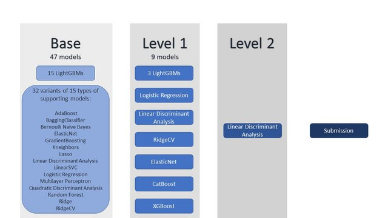

# Tabular Playground Series - Oct 2021（AUC，NN 的意外统治）

> 主题：tabular ｜ 子类：— ｜ 领域：—（合成数据） ｜ 类别：Playground
> 截止：2021-10-31 ｜ 队伍数：1089 ｜ 机制：标准赛 ｜ 指标：ROC AUC
> 数据来源：`intel/tabular-playground-series-oct-2021/`（80 条主题索引 + 6 篇 write-up 正文）

## 1. 任务与数据

- 首个月度系列赛（Oct 2021）：大表（百万行级）二分类 AUC。
- 本场最大异常现象：**深度学习模型对公开榜有巨大影响**——其预测与 XGB/EDA 几乎不相关，却能显著拉分；社区据此转向"NN + KMeans 特征"路线。

## 2. 验证方案

- 9th：按模型类型选择各自最优缩放与特征子集（许多慢模型只用部分特征；QDA 只用二值特征），以 CV 定预处理。
- 3rd：公开/私有 AutoML 组合 + NN（25 seed 稳健化）+ 伪标签（概率 <0.05→0，>0.95→1 加回训练）收尾 +0.000X。

## 3. 模型家族

| 方案 | 使用者层次 | 关键点 | 出处 |
| --- | --- | --- | --- |
| 多模型大栈（不同缩放/特征子集 + 借来的特征集） | 9th | 特征集按作者命名致谢 | topic 284492 |
| 多输入 NN + KMeans 特征 | 4th | 公开分 0.85424 → 0.85503 | topic 284560 |
| AutoML + NN + 伪标签 | 3rd | 稳健种子迭代 | topic 284594 |

## 4. 关键技巧

- **NN 与大表**：多输入神经网络（多组特征分路输入）在本场意外强势；KMeans 聚类特征进一步抬升 NN 分数——"与树模型不相关的预测"本身就是集成价值。
- 多样性工程：同一表格按"预处理 × 特征子集 × 模型族"三维展开（9th 的完整实践）。
- 伪标签的温和用法：只取两端高置信样本（<0.05 / >0.95），收益小而稳。
- 社区特征资产（Boruta-SHAP 选择、KMeans++ 特征）直接被下游复用——公开协作的早期样本。

## 5. 可迁移性评估

- **可直接迁移**：按模型特性定制预处理/特征子集；NN 与树预测的低相关性作为集成理由；两端高置信伪标签；聚类特征。
- **需要前提**：数据规模支持 NN 训练；多样性的模型库。
- **不建议照搬**：对所有模型用同一套预处理；把伪标签当主要增益（本场仅 0.000X）。

## 6. 对新手的关键启示

- "树模型之外的一个强异类"（本场是 NN）经常是排名分水岭——从最早的月度系列赛起就是这个规律。
- 特征集可以继承和致谢：名字写清来源，复用不是抄。
- 大表先解决读取（本场有"只读部分数据"的教程帖），再谈模型。

## 8. 轻读结论（2026-10 补）

**一句话**：百万行大表 = "**工程先行 + 强 NN**"：社区头部帖子都在讲分块读取（nrows/skiprows）、dtype/gc、datatable/dask/cudf 与 GPU LightGBM 注意点；榜单上方是"AutoML/GBDT + 强多输入 NN"——4th 的 NN 加 KMeans 特征（0.85424→0.85503），3rd 用 25-seed NN + 极端置信伪标签，9th 堆 47 基模型 → 9 元模型 → LDA。

- 9th（284492）：15 LGBM×20 seeds + 32 变体；逐模型缩放；L1 九个元模型；L2 LDA。
- 4th（284560）：多输入 NN + KMeans；"深度学习对本场公榜影响很大"。
- 3rd（284594）：AutoML GBDT + NN（25 seeds）+ 伪标签（<0.05/>0.95）。
- 工程（75/56/25 票帖）：只读部分数据、gc、datatable/dask/cudf、GPU 注意点。
- 特征（36/27 票帖）：内置重要性不可信 → SHAP/Boruta；feature22 特殊性。

**裁决**：大表先解 I/O/内存；GBDT 同质化后加异质 NN；重要性用 SHAP 复核；伪标签取极端置信；数据量大时深堆叠可行。

**悬案**：1st/2nd/5th–8th 未收录；KMeans 特征细节未展开。

## 9. 图表证据

**图 1**（topic 284492）：47 基 → 9 元 → LDA 的三级栈。

## 10. 出处

- 9th：多模型栈与特征借用：https://www.kaggle.com/competitions/tabular-playground-series-oct-2021/discussion/284492
- 4th：NN + KMeans 特征：https://www.kaggle.com/competitions/tabular-playground-series-oct-2021/discussion/284560
- 3rd：AutoML + NN + 伪标签：https://www.kaggle.com/competitions/tabular-playground-series-oct-2021/discussion/284594
- 百万行读取（75 票）：https://www.kaggle.com/competitions/tabular-playground-series-oct-2021/discussion/275669
- 大表教程汇编（56 票）：https://www.kaggle.com/competitions/tabular-playground-series-oct-2021/discussion/275712
- SHAP 重要性警告（36 票）：https://www.kaggle.com/competitions/tabular-playground-series-oct-2021/discussion/276953
