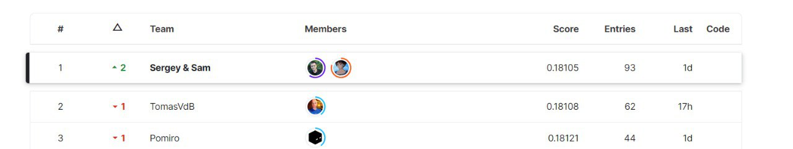
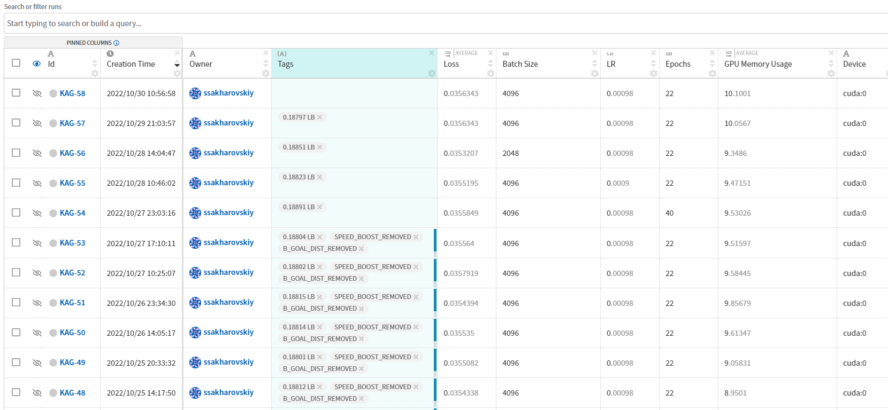

# Tabular Playground Series - Oct 2022（在线学习赛与"5 分钟的冠军"）

> 主题：tabular ｜ 子类：— ｜ 领域：—（在线学习机制） ｜ 类别：Playground
> 截止：2022-10-31 ｜ 队伍数：463 ｜ 机制：标准赛（在线学习） ｜ 指标：Mean Columnwise Log Loss
> 数据来源：`intel/tabular-playground-series-oct-2022/`（80 条主题索引 + 6 篇 write-up 正文）

## 1. 任务与数据

- 官方 overview 明确指向 **online learning**（并提供 FTLR notebook 参考）：数据按时间流入，需要逐步生成预测——与批量训练范式不同。
- 社区资源帖给出在线学习入门清单（Qwak 对比文、awesome-online-ml 仓库、creme 库视频等）。

## 2. 验证方案

- 在线学习场景的验证接近"前向滚动"：每个时间步只能使用此前数据；离线 K 折与线上机制错位，需按时间结构设计。

## 3. 模型家族

| 方案 | 使用者层次 | 关键点 | 出处 |
| --- | --- | --- | --- |
| 主机方基线方案 | Host | 官方视角 | topic 364908 |
| "100+ 模型集成 + 最后一小时选提交" | 被下架团队 | 冠军 5 分钟后被判作弊 | topic 363288 |
| 在线学习入门资源 | 社区 | FTLR/creme | topic 356584 |

## 4. 关键技巧与警示

- **在线学习的工程要点**：逐样本/逐批更新、概念漂移适应、计算与内存约束；官方指定的 FTLR（Follow-The-Regularized-Leader）是轻量首选。
- **"5 分钟冠军"事件**：一支团队自称训练 100+ 模型做集成、并在最后一小时选提交，随后被平台判定违规下架并申诉——**在线学习赛里"多次查询/联动提交"的规则边界很敏感**，工程炫耀帖也可能是违规案例。
- 内存优化（dtype 转换省 75% 内存）在本场是实用工程帖。

## 5. 可迁移性评估

- **可直接迁移**：FTLR/在线学习工具链认知；逐时间步评估设计；内存压缩工程。
- **需要前提**：赛制确为在线/流式；规则对交互查询的要求要先读清。
- **不建议照搬**：把该队的操作方式当模板（结果是被判违规）；忽视规则边界的"极限优化"。

## 6. 对新手的关键启示

- 遇到"online learning"机制的比赛，先搭 FTLR 基线，再谈模型；它与批量赛是两种游戏。
- 读规则比读方案更优先：本场有团队在"冠军 5 分钟"后被下架，代价巨大。
- 工程优化（内存/速度）在流式场景直接决定可行性。

## 8. 轻读结论（2026-10 补）

**一句话**：火箭联盟状态预测 = **对称群 + 球员对建模**：主办方基线用"网络中的网络"处理队友/对手对，并把 **144 种等价表示**（X/Y 翻转 × 两队 3! 排列）用于训练增强与测试时平均（后者提升"令人惊讶"）；榜首团队（93 次提交、一度 0.18105）因平台误判被移除，留下"5 分钟冠军"治理事件。

- 主办方（364908）：球+2×3 球员输入；demoed 用标志 + OOD 占位；球员级/队友对/对手对/再球员级 conv+pool；多时间窗辅助目标（Y=1..10）；私榜 0.17759。
- 榜单事件（363288）：100+ 模型集成 + 最后选提交；被移除后申诉并展示 Neptune 实验日志。
- 在线学习资源（70 票）：流式预测/概念漂移/creme·river/FTRL。
- 工程（40 票）：dtype 下采样 + parquet 从 10.0GB 降到 3.15GB（-68.6%）。
- 社区：验证防过拟合（33 票）、数据表示（32 票）、球员 NaN（24 票）、球场细节（20 票）、激活函数对比（20 票）。

**裁决**：输入有对称群时显式建模并做测试时平均；多智能体状态建模用"对关系 + 池化"；移除实体要有标志位；流式数据先做内存工程；保留实验日志以备审查。

**悬案**：榜首完整方案未公开；官方判定说明未收录。

## 9. 图表证据

**图 1**（topic 363288）：Sergey & Sam 以 0.18105 列第 1（后被移除）。

**图 2**（topic 363288）：Neptune 实验日志作为自证材料。

## 10. 出处

- "5 分钟冠军"事件帖：https://www.kaggle.com/competitions/tabular-playground-series-oct-2022/discussion/363288
- 在线学习入门资源：https://www.kaggle.com/competitions/tabular-playground-series-oct-2022/discussion/356584
- 主机方基线方案：https://www.kaggle.com/competitions/tabular-playground-series-oct-2022/discussion/364908
- dtype 压缩（40 票）：https://www.kaggle.com/competitions/tabular-playground-series-oct-2022/discussion/356540
- 防过拟合验证（33 票）：https://www.kaggle.com/competitions/tabular-playground-series-oct-2022/discussion/359714
- 数据表示与 FE（32 票）：https://www.kaggle.com/competitions/tabular-playground-series-oct-2022/discussion/356718
