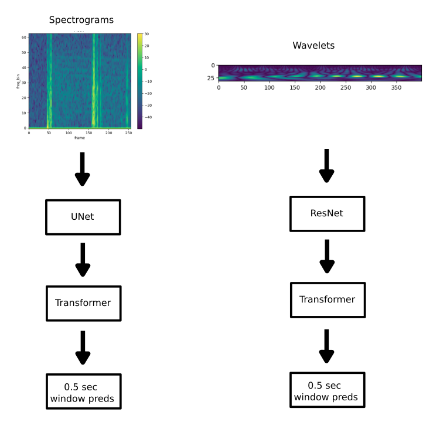

# TLVMC - Parkinson's Freezing of Gait Prediction

> 主题：tabular（传感器时序）｜ 子类：— ｜ 领域：医疗 ｜ 类别：Research
> 截止：2023-06-08 ｜ 队伍数：1379 ｜ 机制：代码赛 ｜ 指标：事件级 F1（多任务）
> 数据来源：`intel/tlvmc-parkinsons-freezing-gait-prediction/`（80 条主题索引 + 6 篇 write-up 正文）

## 1. 任务与数据

- 预测目标：由 3D 加速度计数据预测帕金森患者的**步态冻结（Freezing of Gait）事件**及其严重程度（多任务）。
- 数据形态：多传感器时序（腕/踝等）+ 患者标注；事件稀疏、个体差异大。
- 构造陷阱：
  - **事件级指标**（需要起止点定位与后处理）；
  - 任务多元（是否冻结 / 严重度 / 具体类型）→ 需要多模型或多头；
  - 患者个体差异 → 分组验证。

## 2. 方案谱系

| 方案 | 名次 | 关键点 |
| --- | --- | --- |
| **Transformer + 加速度数据** | 1st | 关键决策是"多任务多头 + 充分利用加速度通道"；作者特别致谢 **Kaggle 免费 GPU/TPU**——他本人的显卡只是 1050 Ti |

## 3. 关键技巧

- **多任务学习**（共享时序主干 + 多个任务头）。
- **传感器通道融合**（多部位加速度计）。
- **事件级后处理**（去抖、最小事件长度约束）。
- **善用云端免费算力**（1st 的坦率经验：本地方案受显卡限制，靠 Kaggle 资源完成）。

## 4. 可迁移性评估

- **可直接迁移**：
  - 多任务共享主干 + 多头；
  - 事件级指标的去抖/最小长度后处理（与 CMI Sleep、Feedback 一致）；
  - 按患者分组验证。
- 需要前提：时序建模能力；足够算力（可用云端）。
- 不建议照搬：单任务单模型处理多元目标。

## 5. 对新手的关键启示

1. **多任务往往是"一个比赛多个指标"的自然解法**。
2. **算力不足不是终点**——1st 用 Kaggle 免费资源完成训练（这也是 Kaggle 平台的价值之一）。
3. 与 CMI 传感器、HMS-EEG、MABe 对照：**生物信号类比赛的方法高度一致**。

## 6. 轻读结论（2026-10 补）

**一句话**：极噪可穿戴时序 + 三事件 AP——**训练短窗口、推理长窗口**是最大单点杠杆（2nd：tdcsfog 1000→5000、defog 5000→30000）；其余是标签降分辨率与"频谱/小波"互补表示。

- 1st（416026）：Transformer + 2×BiLSTM；ViT 式 patch（15552/18 → 864×54）；**标签按 patch 降分辨率 + mask BCE**；tdcsfog/defog 各自建模。
- 2nd（416057）：GRU；**训练短、推理长**（自评最关键）；逐 ID RobustScaler + 差分/累积和；推理取中段避免边缘；DeFog notype 用 Event 列造伪标签；公榜选模型、CV 选长度。
- 6th（415992）：频谱图（STFT+UNet+Transformer）擅长 StartHesitation/Turn，小波（ResNet+Transformer）擅长 Walking，0.369/0.462；**嵌套 CV** 模拟 250 序列平均；时间邻近偏置掩码防过拟合。
- 4th：多层双向 GRU + 残差；8th：5 折 1D-ResNet。

**裁决**：事件型时序要先调"推理上下文长度"与"标签分辨率"；CV 与公榜脱钩时把调参与选模放到不同信号源；数据噪声先审计再建模（62 票数据质疑帖）。

**悬案**：3rd/5th/7th 方案缺失；1st 验证细节未公布；"训练短/推理长"的机制无定论。

## 7. 图表证据

**图 1**（topic 415992）：频谱图→UNet→Transformer 与小波→ResNet→Transformer 双分支，均输出 0.5 秒窗预测。

## 8. 出处

- 讨论区索引：`intel/tlvmc-parkinsons-freezing-gait-prediction/topics.md`（80 条）
- 已收录 write-up（6 篇）：
  - 1st Transformer 多任务（117 票）：https://www.kaggle.com/competitions/tlvmc-parkinsons-freezing-gait-prediction/discussion/416026
  - 2nd（62 票）：https://www.kaggle.com/competitions/tlvmc-parkinsons-freezing-gait-prediction/discussion/416057
  - 6th 频谱图与小波（66 票）：https://www.kaggle.com/competitions/tlvmc-parkinsons-freezing-gait-prediction/discussion/415992
  - 4th 双向 GRU（37 票）：https://www.kaggle.com/competitions/tlvmc-parkinsons-freezing-gait-prediction/discussion/416410
  - 数据质疑（62 票）：https://www.kaggle.com/competitions/tlvmc-parkinsons-freezing-gait-prediction/discussion/403470
  - 数据更新与重算（29 票）：https://www.kaggle.com/competitions/tlvmc-parkinsons-freezing-gait-prediction/discussion/406700
- 轻读全本：`analysis/deep/tlvmc-parkinsons-freezing-gait-prediction.md`（Tier B 轻读：对照矩阵/裁决/证据分级/悬案 + 1 图证）
