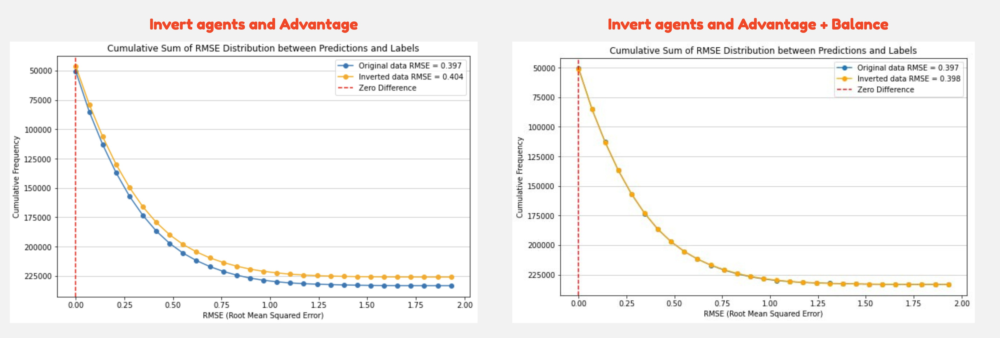

# UM - Game Playing Strength of MCTS Variants

> 主题：tabular ｜ 子类：— ｜ 领域：游戏 AI ｜ 类别：Research
> 截止：2024-12-02 ｜ 队伍数：1608 ｜ 机制：代码赛 ｜ 指标：MSE（选手普遍报 RMSE ≈0.41）
> 数据来源：`intel/um-game-playing-strength-of-mcts-variants/`（80 条主题索引 + 6 篇 write-up 正文）

## 1. 任务与数据

- 预测目标：预测不同 MCTS（蒙特卡洛树搜索）变体在不同棋类游戏上的**对局强度**。
- 数据形态：表格型特征（算法参数 + 游戏类型 + 对局结果统计）。
- 构造陷阱：
  - 强度是**组合效应**（算法 × 游戏），存在强交互；
  - 特征工程需要理解 MCTS 机制；
  - 评估可能包含"未见组合"的泛化。

## 2. 方案谱系

| 方案 | 名次 | 关键点 |
| --- | --- | --- |
| **对每个游戏的起始局面跑数秒树搜索，生成"平衡度"特征** | 1st | 把**树搜索当作特征生成器**：用搜索得到的局面平衡性描述游戏的内在难度，再喂给表格模型 |

## 3. 关键技巧

- **把"昂贵但可计算"的模拟结果当特征**（搜索/仿真的输出作为表格特征）。
- **特征源自领域机制**（平衡度、分支因子等博弈论量）。
- 表格模型处理"算法 × 游戏"的交互（可显式构造交叉特征或让 GBDT 学习）。

## 4. 可迁移性评估

- **可直接迁移**：
  - **用仿真/搜索生成元特征**（在算力允许时非常有效，也见于 AutoML、系统性能预测）；
  - 领域机制导出的特征（分支因子、平衡度）。
- 需要前提：可运行的目标环境（本场是游戏引擎）；数秒级的搜索预算。
- 不建议照搬：只用手工参数特征（缺少环境内在难度的刻画）。

## 5. 对新手的关键启示

1. **"跑仿真生成特征"是一个被低估的强力手段**（算力换特征）。
2. 组合型任务（A×B）要显式考虑交互。
3. 与 NeuroGolf/Santa 系列对照：**同一场比赛里，搜索既能当解法也能当特征来源**。

## 6. 轻读结论（2026-10 补）

**一句话**：**双向对称性增强（flip）是公共最大增量，分组 CV 是底线，"Trust CV" 比 "Trust LB" 更可复制**；1st 另以"起始局面树搜索元特征"取胜。

- 1st（95 票）：MCTS 起始局面树搜索特征 +0.045 CV/+0.012 LB；额外数据 14,365 行（+0.004 CV，边际递减）；等渗回归 +0.002；三模型 20 模型集成；**Trust CV 双榜击败 Trust LB**；自认漏掉 flip 增强。
- 6th（53 票）：零成本数据生成把 OOF 缺口补平（**必须同时反转 Balance**，0.404→0.398）；手工特征 + 两阶段集成，CV 0.3905。
- 3rd（68 票）：flip + StratifiedGKF + TF-IDF-SVD + null importance；两阶段堆叠；×1.12 后处理 +0.002。
- 7th：flip +0.01 LB；top-20 交叉特征；dart 提 CV 伤 LB；LGB+NN 混合 0.423 PB。
- 洞察（94 票）：换 seed LB ±0.002；700 vs 200 特征 CV 几乎相同 → 有效信号集中。

**裁决**：先用对称性增强与分组 CV 打底，再用 GBDT 集成 + 分布校准收尾；昂贵的数据生成与文本特征都是边际项。

**悬案**：2nd/4th 方案缺失；"树搜索 + flip 混合 ~0.407" 仅为 1st 估算；树搜索复现成本高（18GB RAM 常驻）。

## 7. 图表证据

**图 1**（topic 549582）：左为只反转 agent/Advantage（原始 0.397 vs 翻转 0.404，有缺口），右为再反转 Balance（0.397 vs 0.398，缺口闭合）——"增强必须匹配任务对称性"的直接证据。

## 8. 出处

- 讨论区索引：`intel/um-game-playing-strength-of-mcts-variants/topics.md`（80 条）
- 已收录 write-up（6 篇）：
  - 1st（95 票）：https://www.kaggle.com/competitions/um-game-playing-strength-of-mcts-variants/discussion/549801
  - 3rd 两阶段翻转增强（68 票）：https://www.kaggle.com/competitions/um-game-playing-strength-of-mcts-variants/discussion/549588
  - 5th（56 票）：https://www.kaggle.com/competitions/um-game-playing-strength-of-mcts-variants/discussion/549585
  - 6th（53 票）：https://www.kaggle.com/competitions/um-game-playing-strength-of-mcts-variants/discussion/549582
  - 7th（44 票）：https://www.kaggle.com/competitions/um-game-playing-strength-of-mcts-variants/discussion/549617
  - 洞察（94 票）：https://www.kaggle.com/competitions/um-game-playing-strength-of-mcts-variants/discussion/534634
- 轻读全本：`analysis/deep/um-game-playing-strength-of-mcts-variants.md`（Tier B 轻读：对照矩阵/裁决/证据分级/悬案 + 3 图证）
